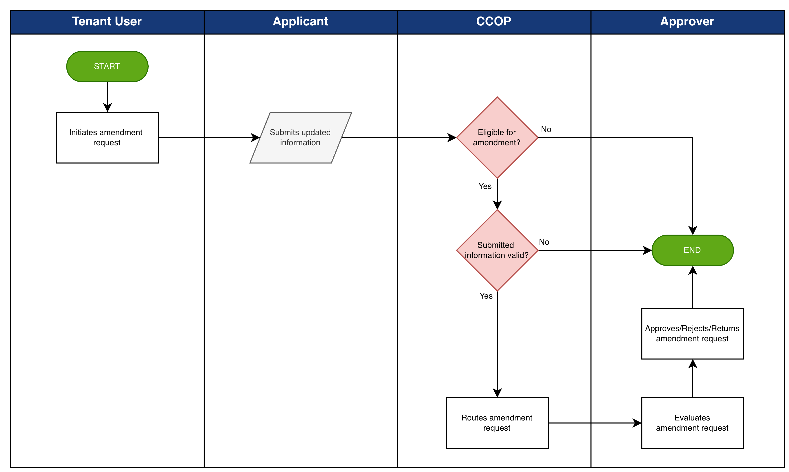

# Credit Amendment Workflow

The **Credit Amendment Workflow** allows authorized tenant users to initiate requests to modify or update previously approved credit application information.

This process supports operational scenarios where updates to customer information, credit limits, or supporting documentation are required after the initial approval:

1. **Amendment Request Initiation** – A change or update request is initiated by an authorized tenant user to modify an existing credit application or credit account information.
2. **Validation** – The system validates the eligibility conditions for the amendment, including verification of required fields and applicable business rules.
3. **Information Submission** – Updated information or supporting documentation is provided to support the requested amendment.
4. **Routing** – The amendment request is routed through the configured approval workflow to the appropriate authorized approvers.
5. **Outcome** – The amendment request is either approved or rejected based on the review outcome.

This workflow ensures all updates to approved credit records undergo appropriate review and authorization.

*Credit Amendment Workflow*