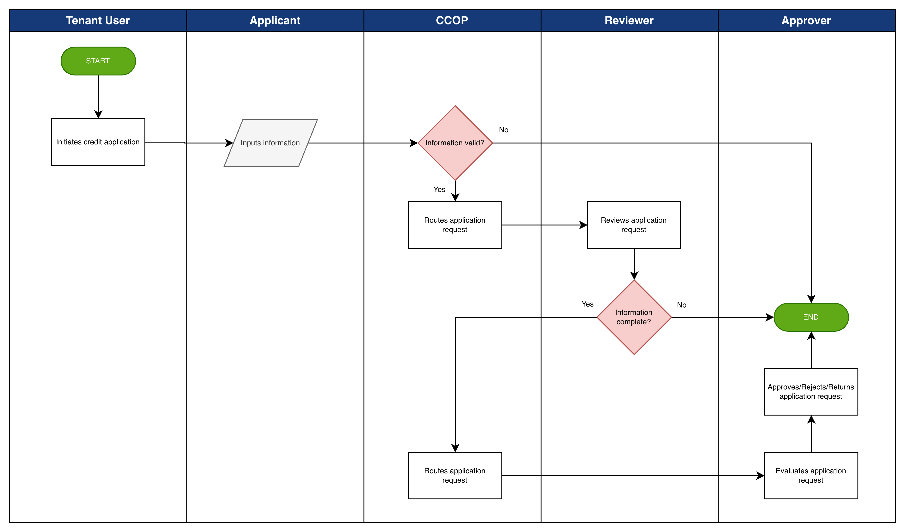

# Credit Application Workflow

The Credit Application Workflow represents the primary process in the platform, enabling applicants to submit credit card applications and supporting documentation for review and approval.

The process typically follows these stages:

1. Application Initiation - A new credit application is initiated by an authorized tenant user within the platform.
2. Information Submission - The applicant provides the required information and uploads supporting documentation necessary for the credit application.
3. Validation - The platform validates the completeness of required fields and verifies that submission rules are satisfied prior to further processing.
4. Review - Authorized reviewers assess the submitted information and supporting documentation in accordance with the tenant organization's credit and compliance policies.
5. Routing - The application is routed through the configured approval workflow to designated approvers based on approval thresholds and hierarchy rules.
6. Outcome - The application is approved, rejected, or returned for additional information based on the review and approval decision. The platform maintains a complete audit trail of all actions performed during the application lifecycle.

  
*Credit Application Workflow*