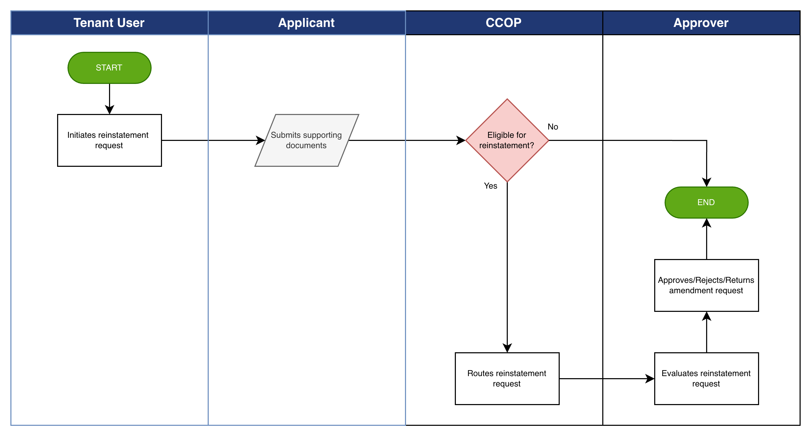

# Credit Reinstatement Workflow

The **Credit Reinstatement Workflow** enables tenant organizations to process requests to
reinstate credit privileges that were previously suspended, rejected, or inactive.

This process allows authorized users to submit reinstatement requests that are evaluated through the defined approval hierarchy:

1. **Reinstatement Request Initiation** – A reinstatement request is submitted by an authorized tenant user for a previously suspended or inactive credit account.
2. **Validation** – The system validates eligibility conditions for reinstatement, including completeness of required information and supporting documentation.
3. **Information Submission** – Supporting documents and any required updated information are provided to support the reinstatement request.
4. **Routing** – The reinstatement request is routed through the configured approval workflow to authorized reviewers.
5. **Outcome** – The reinstatement request is either approved or rejected based on the review outcome.

The platform records all reinstatement activities to maintain transparency and auditability of
credit decision processes.

*Credit Reinstatement Workflow*