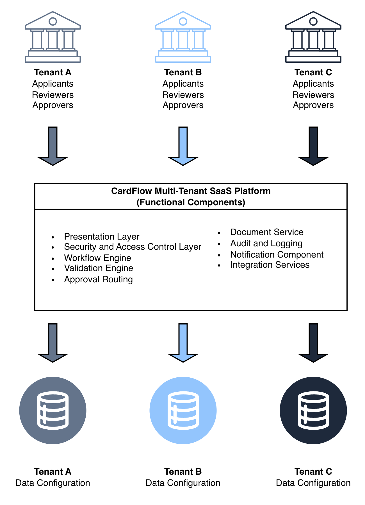

# Multi-Tenant SaaS Architecture Context
The **CardFlow Credit Origination Platform** operates in a multi-tenant SaaS architecture model where multiple tenant organizations share a common application environment while maintaining logical separation of data, workflow configurations, user access controls, and operational policies.

The architecture ensures that:

- Tenant-specific data remains logically isolated.
- Workflow configurations can vary per tenant organization.
- User access permissions are managed independently per tenant.
- Reporting and audit visibility are restricted according to tenant boundaries.
- Shared platform services can support multiple tenant environments simultaneously.

This architecture model enables centralized platform management while supporting configurable operational behavior across participating organizations.

*Multi-Tenant SaaS Architecture Context*