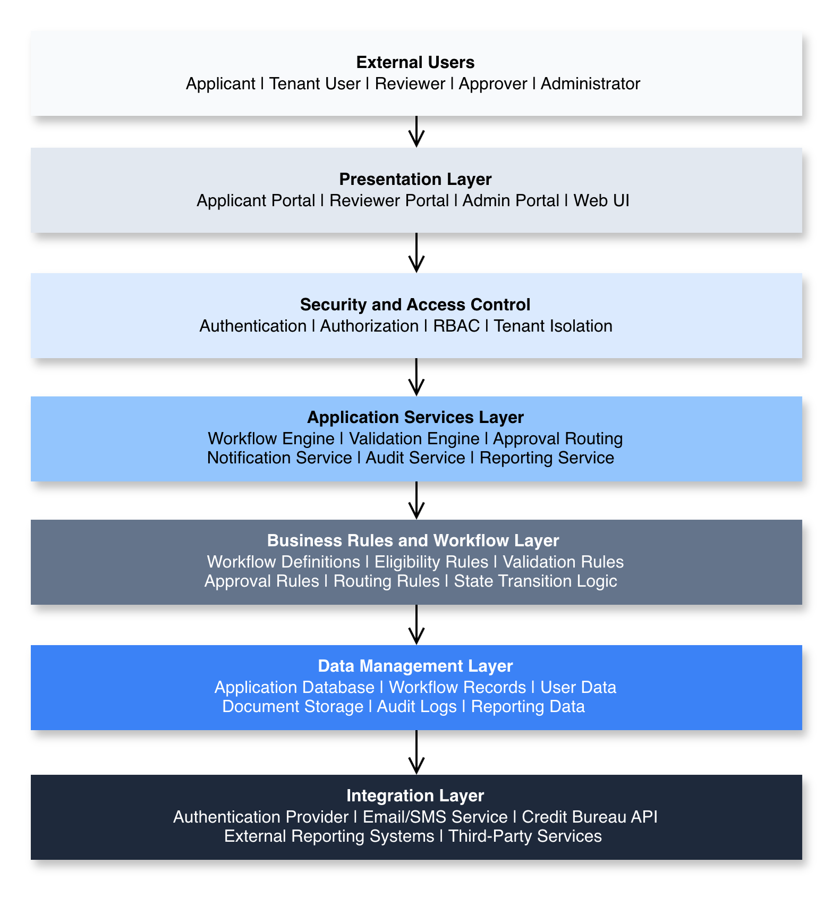

# Solution Architecture Overview
The **CardFlow Credit Origination Platform** is a multi-tenant SaaS solution designed to automate and manage the end-to-end lifecycle of credit origination processes, including credit application submission, amendment processing, reinstatement processing, validation, review, routing, approval, and outcome management.

The platform provides a centralized environment where applicants, tenant users, reviewers, approvers, and administrative users interact with configurable workflow-driven services to process requests according to defined business rules and operational policies.

The solution architecture is structured around the following primary architectural domains.

*Primary Architectural Layer*

Architectural Layer | Description
--- | ---
**External Users** | Users and stakeholders that interact with the platform to initiate, process, review, approve, and manage requests.
**Presentation Layers** | Provides web-based interfaces for applicants, tenant users, reviewers, approvers, and administrators.
**Security and Access Control Layer** | Enforces authentication, authorization, RBAC, tenant isolation, and secure access management.
**Application Services Layer** | Handles workflow orchestration, validation, routing, notifications, audit operations, and reporting services.
**Business Rules and Workflow Layer** | Applies workflow logic, validation rules, eligibility checks, routing conditions, and state transition rules.
**Data Management Layer** | Manages application data, workflow records, documents, user information, and audit logs.
**Integration Layer** | Supports communication with external systems and third-party services.

*Solution Architecture Overview*

The platform architecture supports configurable workflow processing to allow tenant organizations to adapt approval structures, routing behavior, validation logic, and operational rules based on business requirements.