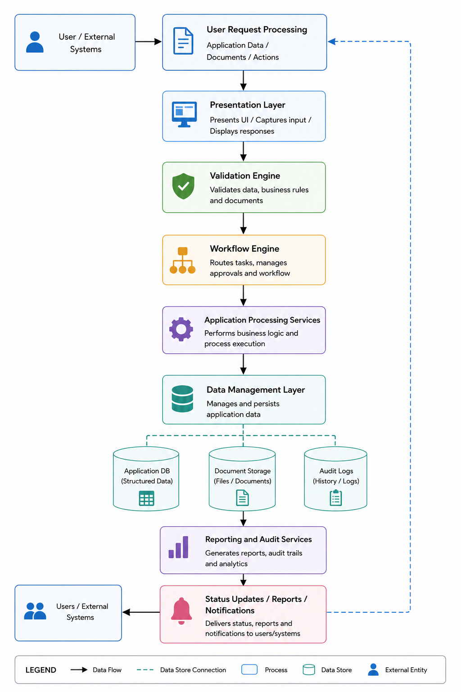

# Data Flow Architecture
This subsection describes how data moves through the platform during workflow processing. User-provided information and supporting documents are captured through the presentation layer, validated by the system, processed through workflow services, stored in the data layer, and recorded for audit and reporting purposes.

*Data Flow Architecture*