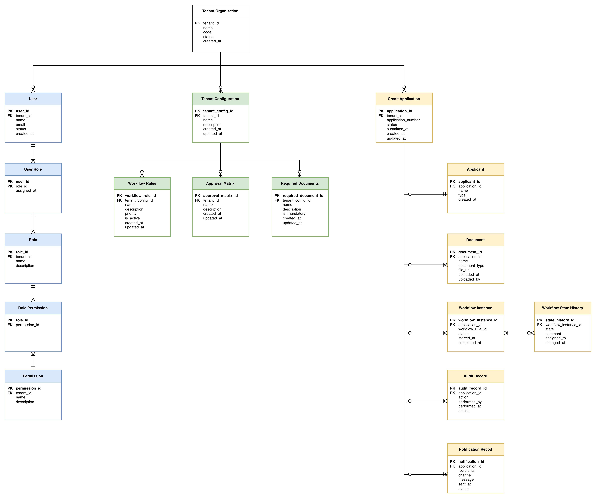

# Entity Relationship Diagram 
This subsection presents a high-level relationship view of the core data entities managed by the platform. 
> **Note**: 
> - The diagram is conceptual and does not define database tables, fields, keys, or physical schema details.
> - The Entity Relationship Diagram (ERD) uses simplified Crow’s Foot Notation to represent relationships between the core business entities of the **CardFlow Credit Origination Platform**.

*Entity Relationship Diagram*