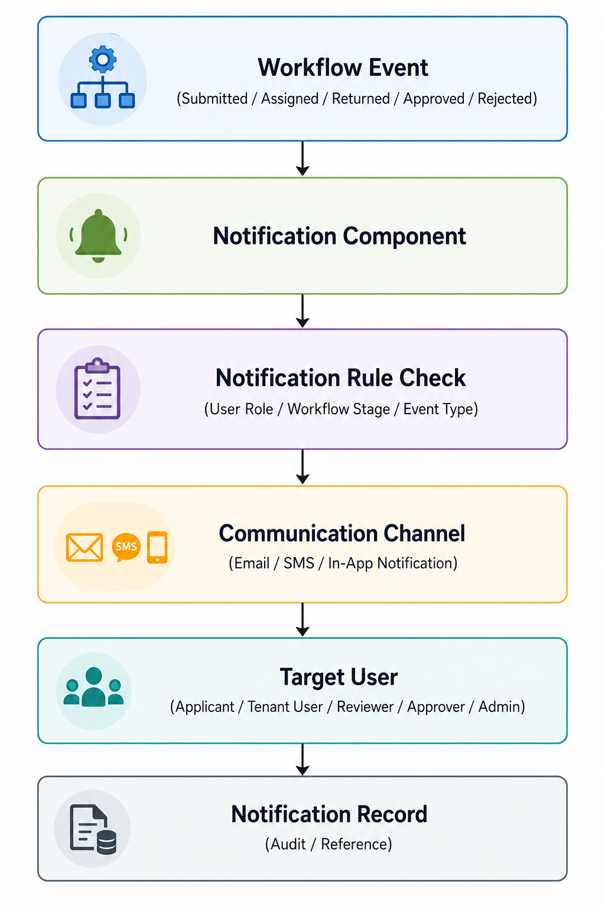

# Notification Architecture
This subsection describes how the **CardFlow Credit Origination Platform** generates and delivers workflow-triggered notifications to keep users informed of request status changes and required actions. The architecture supports timely communication, event-driven notification delivery, and audit logging for traceability.

*Notification Triggers*

Trigger Event | Target User
--- | ---
Request submitted | Reviewer / System users
Request assigned for review | Reviewer
Request assigned for approval | Approver
Request returned for correction | Applicant / Tenant User
Request approved | Applicant / Tenant User
Request rejected | Applicant / Tenant User
Workflow exception occurs | Relevant operational user / Admin

The workflow engine triggers a notification event when a request reaches a defined workflow point. 

The **Notification Component** evaluates the **event type, user role**, and **workflow stage** to determine who should receive the notification and through which channel. 

After delivery, the platform records the notification event for audit and reference purposes.

*Notification Architectures*