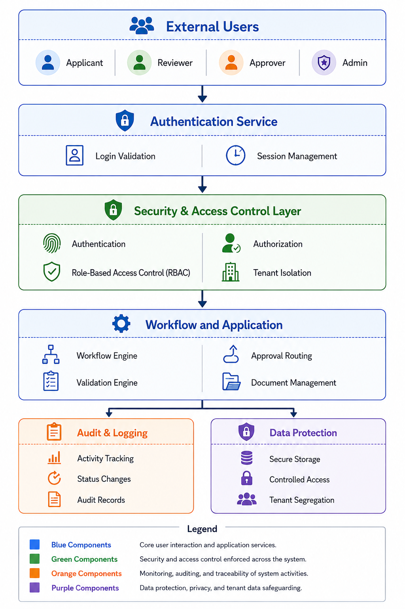

# Security Architecture
This section describes the security architecture of the **CardFlow Credit Origination Platform**, including the authentication, access control, audit, traceability, and data protection mechanisms that safeguard workflow processing, enforce tenant isolation, and protect sensitive information within the multi-tenant SaaS environment.

*Security Architecture*