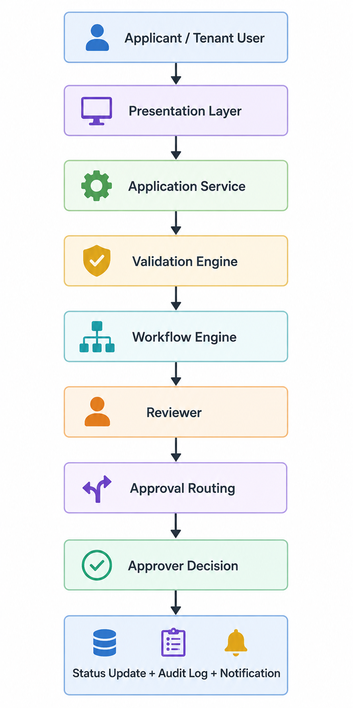

# Credit Application Processing Architecture
The **Credit Application Processing Architecture** shows how the platform handles new credit applications from creation to final decision. The process begins when an applicant or tenant user initiates an application, continues through information submission and validation, and proceeds to review, approval routing, and outcome recording.

*Credit Application Processing Architecture*
