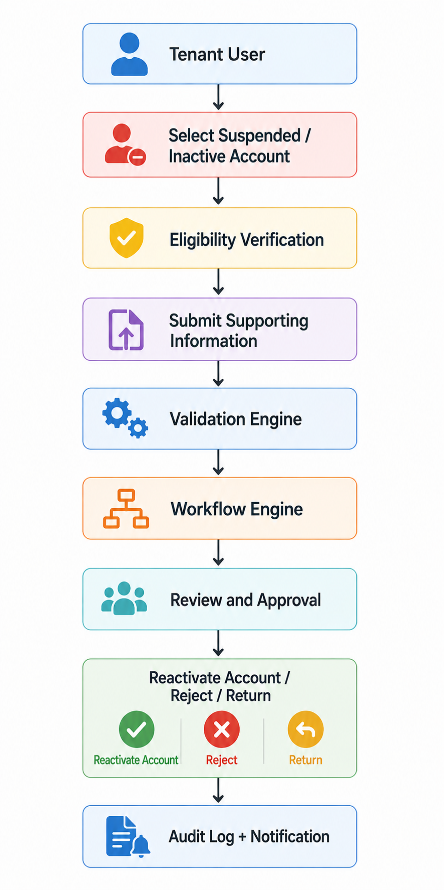

# Reinstatement Processing Architecture
The **Reinstatement Processing Architecture** shows how the platform processes requests to reactivate suspended or inactive credit accounts. The workflow focuses on account status validation, eligibility checks, supporting documentation, review, approval, and final account reactivation or rejection.

*Reinstatement Processing Architecture*