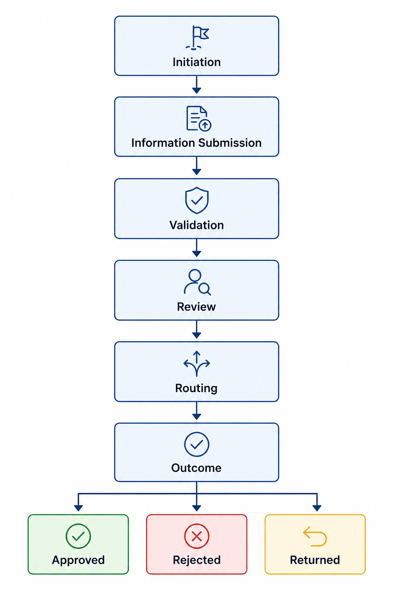

# Workflow Lifecycle Architecture
The **Workflow Lifecycle Architecture** defines the common processing model used across all supported workflows. Each request follows a structured sequence of stages, allowing the platform to manage request progression consistently while applying workflow rules, validation checks, routing logic, and audit tracking.

*Workflow Lifecycle Architecture*