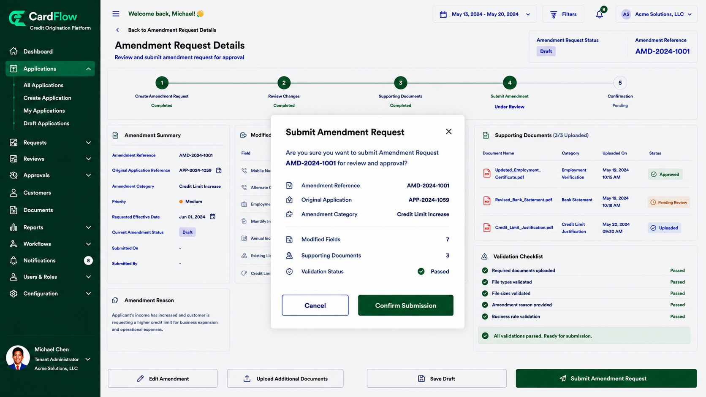
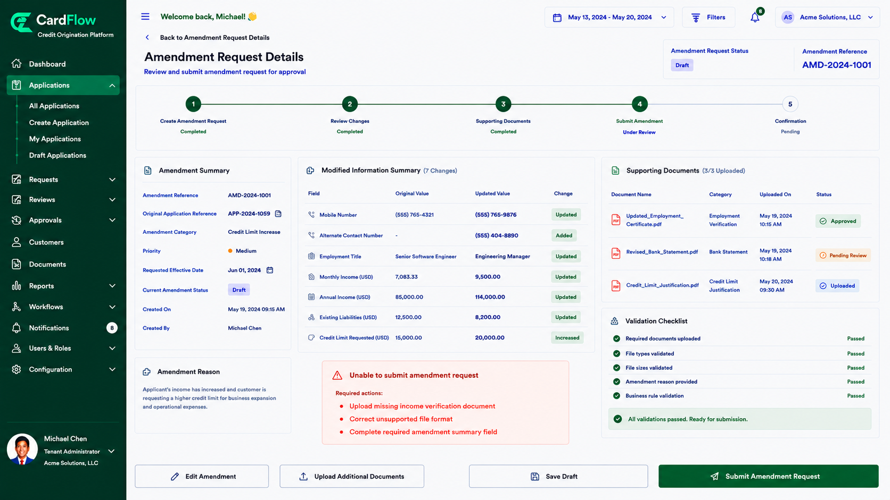

# Submitting an Amendment Request
Submit the amendment request after all updates and supporting documents have been provided.

To submit an amendment request:

1.	Review all modified information.
2.	Verify that all required supporting documents have been uploaded.
3.	Click **Submit Amendment Request**.  
    
    *Submitting an Amendment Request*
    
4.	Confirm the submission when prompted.  
    The system performs validation checks to ensure:
    
    - Required fields are completed.
    - Supporting documents are provided.
    - Uploaded files meet format and size requirements.
    - The requested changes comply with configured business rules.

    If validation fails, the request is returned for correction.      
    
    *Submitting an Amendment Request – Failed Submission Scenario*

**Result**: The amendment request is submitted and progresses to the review workflow.
