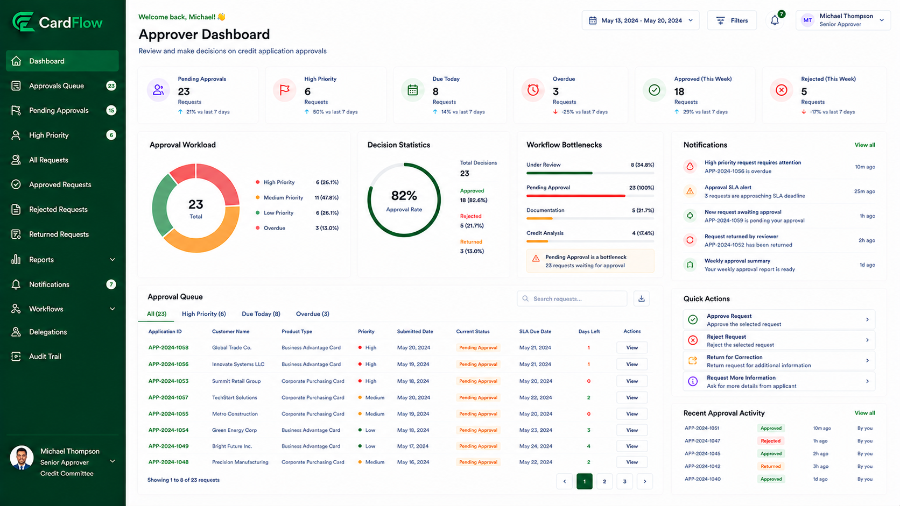

# Approver Functions
This section describes the activities performed by approvers when reviewing requests that have completed validation and review activities and are awaiting a final decision. Approvers evaluate request information, supporting documents, workflow history, and reviewer recommendations before approving, rejecting, or returning requests.   

*Approver Dashboard*