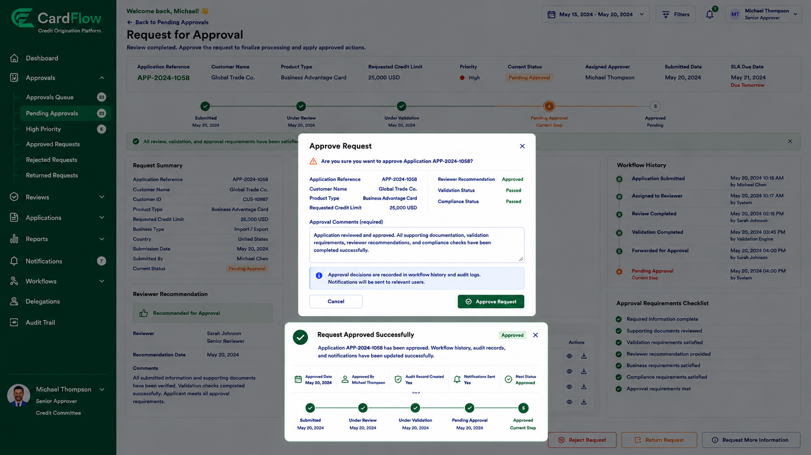

# Approving Requests
Approvers can approve requests that satisfy all review and approval requirements.

To approve a request:

1.	Open the request.
2.	Review all submitted information and supporting documents.
3.	Verify reviewer recommendations and workflow history.
4.	Click **Approve Request**.
5.	Enter approval comments if required.
6.	Confirm the approval action.

When a request is approved:

- The request status changes to **Approved**.
- The approval decision is recorded in the workflow history.
- Audit records are generated.
- Notifications are sent to relevant users.
- Approved changes or actions are applied to the request.

**Result**: The request is approved and processing is completed successfully.  

*Approving Request*