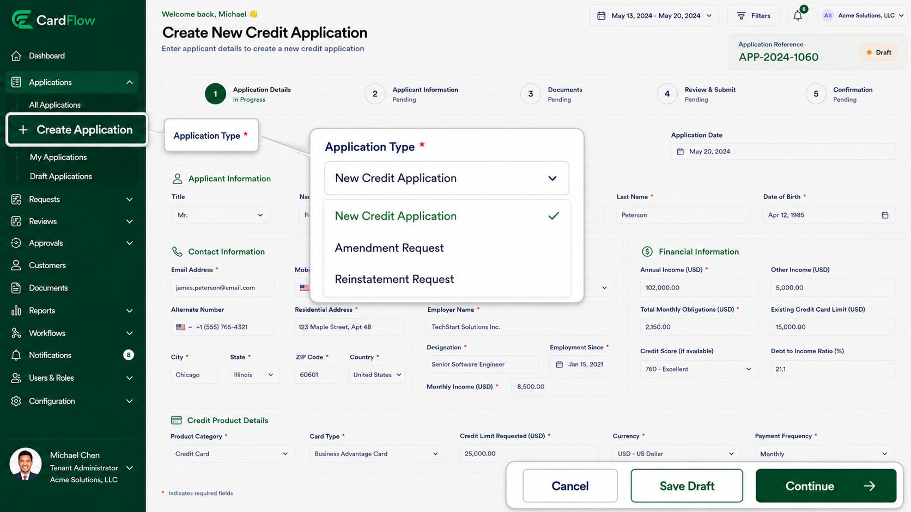

# Creating a New Credit Application
Users can create a new credit application from the dashboard or **Applications** screen.

To create a new credit application:

1.	Navigate to **Applications**.
2.	Click **Create Application**.
3.	Select the desired application type, if applicable.
4.	Enter the required applicant information.
5.	Complete the application details.
6.	Save the application as a draft or proceed with submission.

**Result:** The system creates a new application record and assigns a unique application reference number.

*Creating New Credit Application*