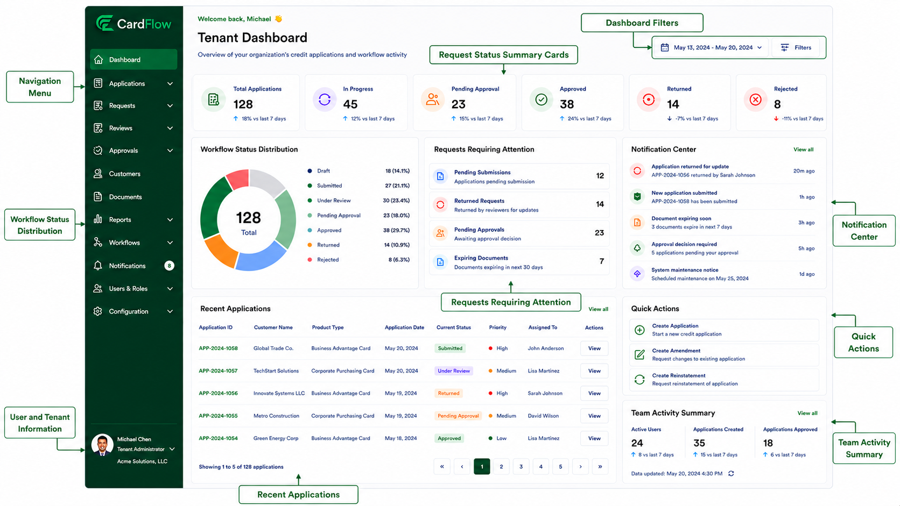

# Dashboard Overview
The **Dashboard** serves as the primary workspace in the **CardFlow Credit Origination Platform**, providing users with visibility into application activity, workflow status, pending actions, notifications, and operational metrics. Dashboard content may vary based on assigned user roles and permissions.

## Dashboard Components
The dashboard is organized into several functional areas that provide quick access to workflow information and commonly used actions.

Key dashboard components include:

- **Navigation Menu**
- **User and Tenant Information**
- **Dashboard Filters**
- **Request Status Summary Cards**
- **Workflow Status Distribution**
- **Requests Requiring Attention**
- **Notification Center**
- **Recent Applications**
- **Quick Actions**
- **Team Activity Summary**

*Tenant Dashboard (Annotated)*

## Navigation Menu
Located on the left side of the screen and provides access to the platform's primary functional areas.

*Navigation Menu*

|Navigation Menu|Description|
|---|---|
**Dashboard**|Provides an overview of application activity, workflow status, notifications, and pending actions.
**Applications**|Allows users to create, view, and manage credit applications throughout their lifecycle.
**Requests**|Displays submitted application, amendment, and reinstatement requests for tracking and processing.
**Reviews**|Provides access to requests awaiting validation, assessment, or review activities.
**Approvals**|Displays requests requiring approval decisions and approval workflow actions.
**Customers**|Maintains customer information associated with credit applications and requests.
**Documents**|Stores and manages supporting documents uploaded as part of workflow requests.
**Reports**|Provides access to operational reports, workflow metrics, and application statistics.
**Workflows**|Displays workflow definitions, request progress, and status tracking information.
**Notifications**|Displays workflow-generated alerts, reminders, and system notifications.
**Users & Roles**|Manages user accounts, role assignments, and access permissions.
**Configuration**|Maintains tenant-specific settings, workflow rules, approval matrices, and system parameters. 

## User and Tenant Information
**User and Tenant Information** displays:

- Logged-in user information
- Tenant/organization name
- User profile access

## Dashboard Filters
**Filters** are used to adjust the displayed metrics and reporting period.
Provides:

- Date range selection
- Dashboard filtering options

## Request Status Summary Cards
**Request Status Summary Cards** allows users to quickly assess overall workflow activity, and provides high-level workflow metrics:
- **Total Applications**
- **In Progress**
- **Pending Approval**
- **Approved**
- **Returned**
- **Rejected**

## Workflow Status Distribution
**Workflow Status Distribution** provides visibility into workflow progression and workload distribution. This dashboard component displays:

- Visual breakdown of requests by status
- Percentage distribution
- Overall request volume

## Requests Requiring Attention
**Requests Requiring Attention** helps users prioritize pending work and highlights items requiring action:

- **Pending Submissions**
- **Returned Requests**
- **Pending Approvals**
- **Expiring Documents**

## Notification Center
**Notification Center** provides visibility into recent platform activity, and displays workflow-generated alerts such as:

- Application submissions
- Returned requests
- Approval requests
- Document expiration notices
- System announcements

## Recent Applications
**Recent Applications** allows users to quickly access active requests. It displays a list of recently created or updated applications, including:

- **Application ID**
- **Customer Name**
- **Product Type**
- **Application Date**
- **Current Status**
- **Priority**
- **Assigned User**

## Quick Actions
**Quick Actions** allows users to initiate common workflow activities, and provides shortcuts to frequently used functions:

- **Create Application**
- **Create Amendment**
- **Create Reinstatement**

## Team Activity Summary
**Team Activity Summary** provides a summary of organizational activity. It displays operational metrics such as:

- **Active Users**
- **Applications Created**
- **Applications Approved**