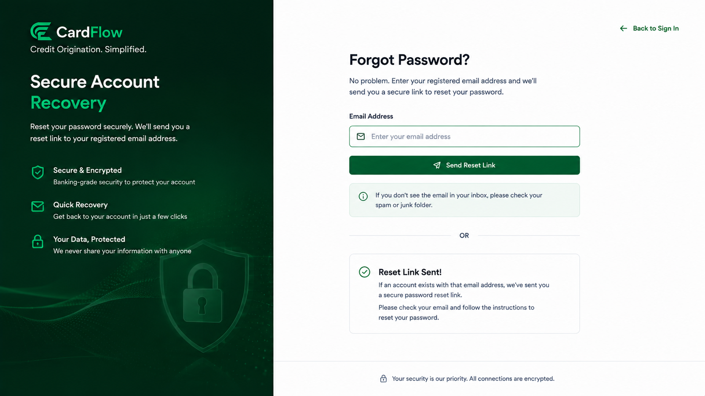
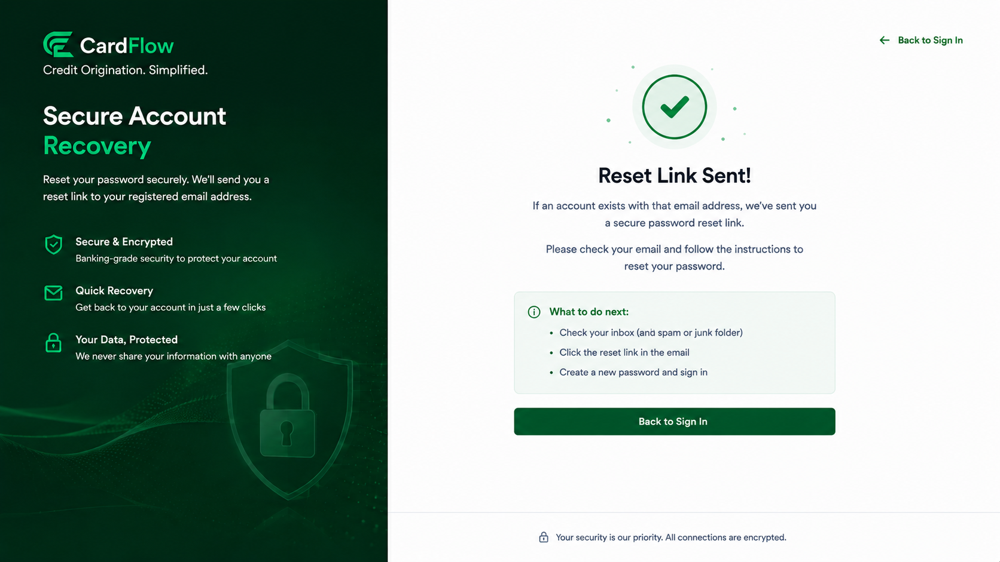

# Resetting Password
Users who are unable to access their accounts due to a forgotten password can initiate the
password reset process from the login page.

To reset your password:

1. Click **Forgot Password**.
2. Enter your registered email address.
3. Follow the instructions provided by the system.
4. Create a new password when prompted.
5. Log in using the updated credentials.  

*Password Reset Page*  

*Password Reset Confirmation*