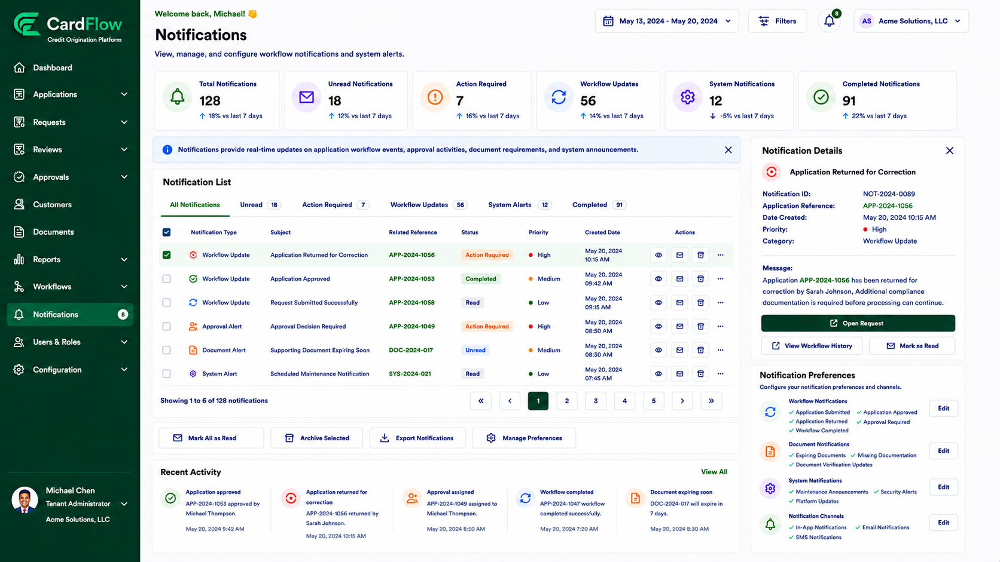
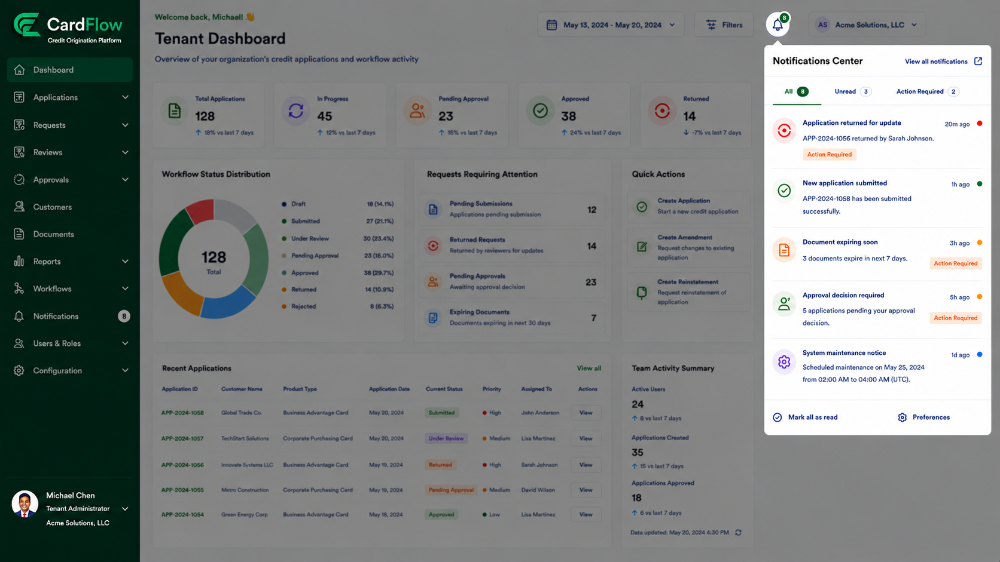

# Notifications
The **Notifications** module provides real-time updates regarding application activities, workflow progress, approval decisions, document requirements, and system-generated events. Notifications help users monitor application status changes, identify actions requiring attention, and stay informed of workflow activities without manually checking individual requests.

*Notifications*

> **Note:**
> The **Notification Center** accessible through the Notifications badge is different from the Notifications module: 
> 
> - The **Notification Center** provides a condensed view of recent notifications and quick access to related records.
> - The **Notifications** module provides a complete notification management workspace where users can view notification history, review notification details, manage notification preferences, and perform notification-related actions.

*Notifications Center*

*Notification Center VS Notifications Module*

Feature|Notification Center|Notification Module
---|---|---
**Access Method** | Notification icon in the application header | Notifications menu in the navigation panel
**Purpose** | Quick access to recent notifications | Full notification management
**Notification Scope** | Recent notifications only | Complete notification history
**Actions Available** |	View notification, open related record, mark as read | Filter, search, manage, archive, configure preferences
**Typical Usage** |	Quick review while working in another page | Dedicated notification monitoring and management
