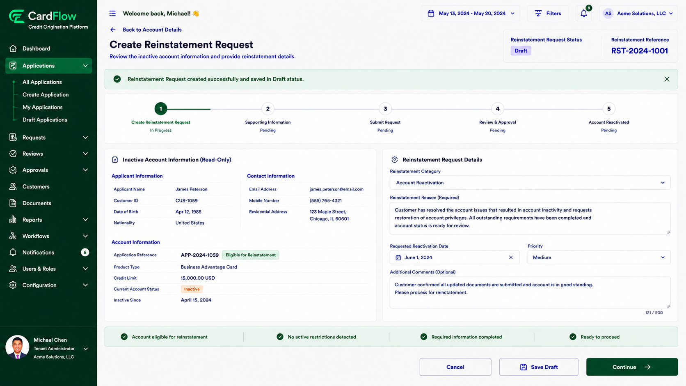

# Creating a Reinstatement Request
Create a reinstatement request to initiate the account reactivation process.  

To create a reinstatement request:  

1.	Open the inactive account record.
2.	Click **Create Reinstatement** Request.
3.	Review the account information.
4.	Provide the reason for reinstatement.
5.	Verify that the request details are correct.
6.	Click **Continue**.  
    The system validates whether the selected account is eligible for reinstatement processing.

**Result**: A new reinstatement request is created and saved in Draft status.

*Create Reinstatement Request Screen*