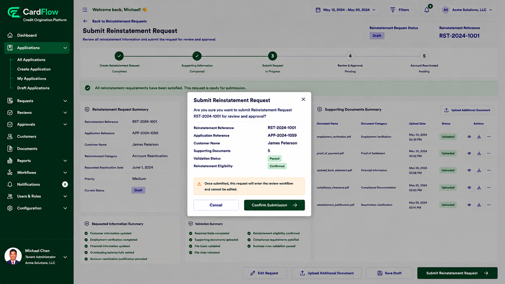

# Submitting the Reinstatement Request
Submit the reinstatement request after all required information and supporting documents have been provided.

To submit a reinstatement request:

1.	Review the reinstatement request details.
2.	Verify that all required documents have been uploaded.
3.	Click **Submit Reinstatement Request**.
4.	Confirm the submission when prompted.  
    The system performs validation checks to ensure:
    
    - Required fields are completed
    - Supporting documentation is provided
    - Uploaded files meet file type and size requirements
    - Reinstatement eligibility requirements are satisfied
    - Business rules and compliance requirements are met

    If validation fails, the request is returned for correction.

**Result**: The reinstatement request is submitted and enters the review workflow.

*Submitting the Reinstatement Request*