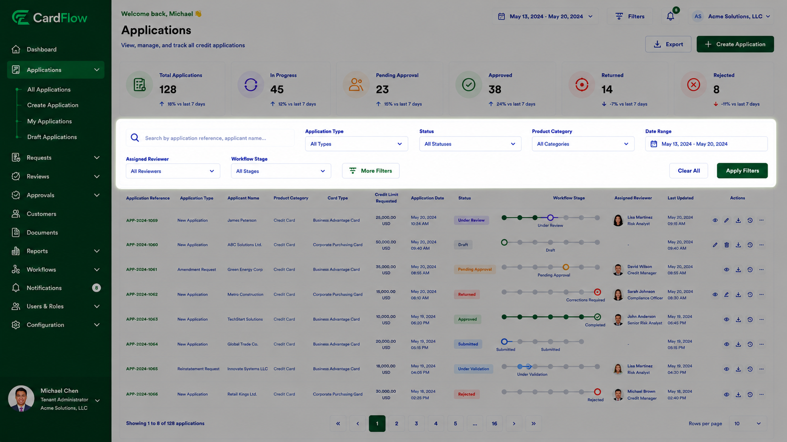

# Searching Applications
Users can search for applications using available search and filtering options.

To search applications:

1.	Navigate to **Applications**.
2.	Use the **Search** field to enter an application reference number, customer name, or other search criteria.
3.	Apply available filters as required.
4.	Review the matching search results.

Common search criteria include:

- Application Reference
- Customer Name
- Product Type
- Status
- Priority
- Submission Date
- Assigned User

> **Note**: Users may combine multiple filters to narrow results.

**Result**: Matching applications are displayed based on the specified search criteria.  

 *Searching Applications*