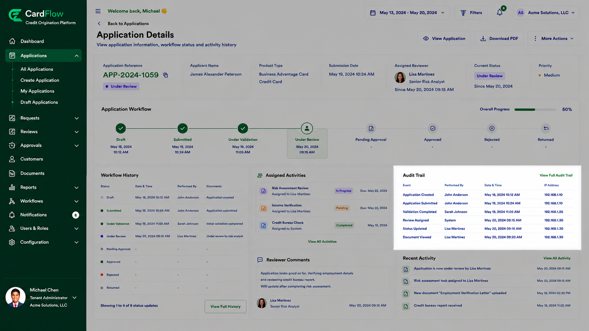

# Viewing Audit Trail
The **Audit Trail** feature provides a detailed record of system activities performed against an application or request.

To view audit history:

1.	Open the required application.
2.	Navigate to the **Audit Trail** section.
3.	Review recorded audit events.  
>**Note**:
    Audit records are maintained for compliance, security, and traceability purposes.

**Result**: The user can review historical changes and actions performed against the application.

Audit records may include:

- Record creation
- Data modifications
- Status updates
- Workflow actions
- Approval decisions
- Document uploads
- User access activities

Each audit record typically includes:

*Audit Trail Fields*

Field | Description
---|---
**Event** | Description of the action
**Performed By** | User who performed the action
**Date/Time** | Timestamp of the activity
**IP Address** | IP address associated with the user that performed the recorded action.

*Viewing Audit Trail*