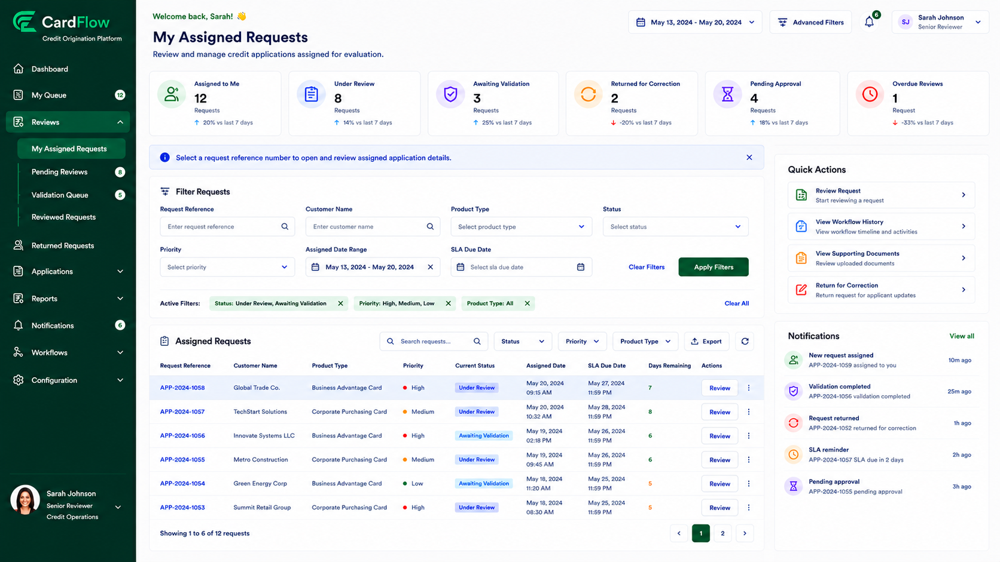

# Accessing Assigned Requests
Reviewers can access requests assigned to them through the review work queue.

To access assigned requests:

1.	Navigate to **Reviews**.
2.	Select **My Assigned Requests**.
3.	Use the available filters to locate a specific request.
4.	Click the request reference number to open the request details page.

**Result:** The selected request is displayed for review.

*Accessing Assigned Requests – My Assigned Requests Screen*