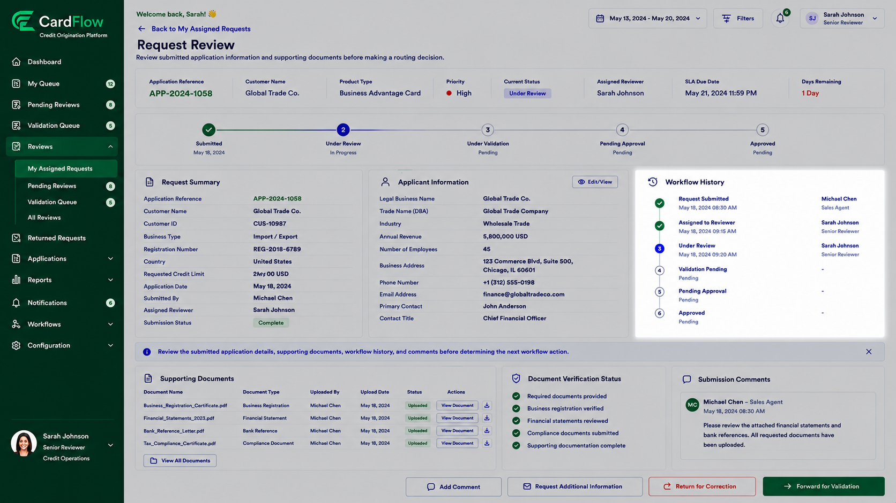

# Reviewing Workflow History Comments
Reviewers can review historical workflow activities and previous comments associated with a request.

To review workflow history:

1.	Open the request.
2.	Navigate to **Workflow History**.
3.	Review status transitions and activities.
4.	Review reviewer and approver comments, if any.
5.	Review previous return reasons, if applicable.

**Result:** The reviewer gains visibility into the complete request history.  

*Reviewing Workflow History Comments*