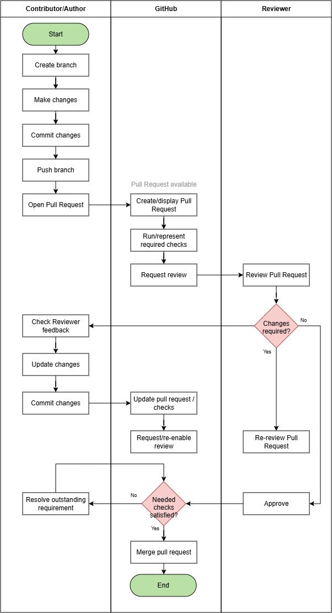
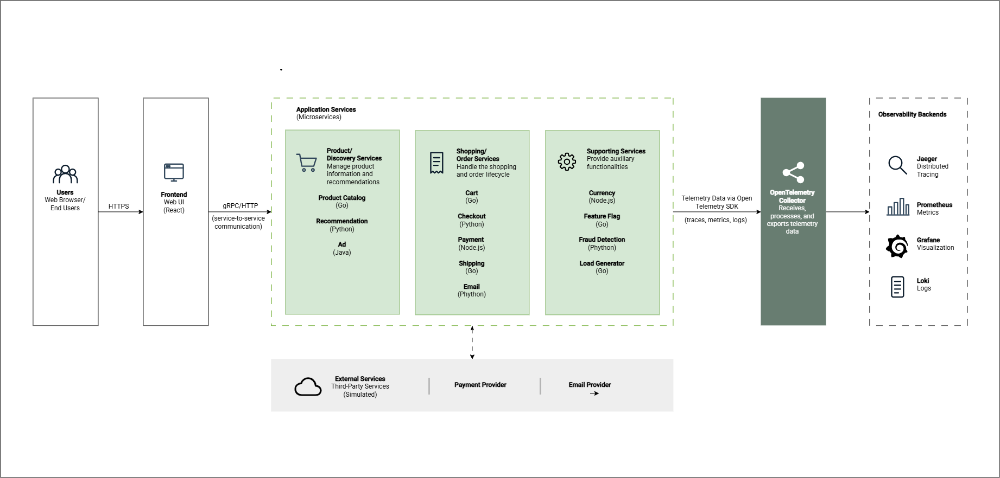
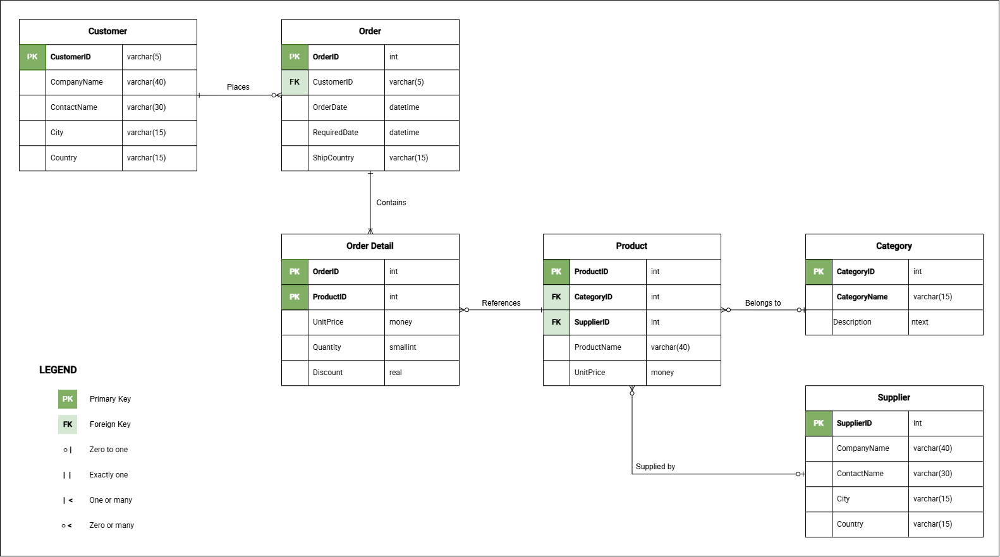

# Visual Documentation

These samples demonstrate how complex technical information can be analyzed, structured, and translated into purposeful visualizations that clarify processes, system relationships, data structures, and technical workflows.

## What This Section Demonstrates

The diagram samples demonstrate experience in:

- Business process visualization
- Workflow and decision flows
- System architecture diagrams
- Data and entity relationships
- Integration and system interactions
- Technical process visualization
- Information hierarchy and visual organization
- Diagram design for technical documentation

## Diagram Samples

Each visualization is presented as a short case study to show not only the finished diagram, but also the reasoning behind it.

The sections provide context for the source material, define the communication problem and intended audience, explain the visualization and design decisions, and identify the references used to support the interpretation.

<!-- Selected diagram samples are presented with supporting context explaining the purpose of the diagram, the information it communicates, and the design decisions used to represent the underlying process or system. -->

*Case Study Fields*

| Section                   | What it conveys                                                                    |
| ------------------------- | ---------------------------------------------------------------------------------- |
| **Source & Context**      | What information or system was studied and where the visualization originated      |
| **Communication Problem** | What aspect of the information is difficult to understand or needs clarification   |
| **Audience**              | Who the visualization is intended to help                                          |
| **Design Decisions**      | Why a particular diagram type, scope, structure, and level of detail were selected |
| **Visualization**      | The resulting visual solution                                                      |
| **Source Material**       | The authoritative references used to understand and verify the subject             |

> **Note:** The diagrams presented in this portfolio are my own interpretations, created for documentation and demonstration purposes based on publicly available technical information. They are not official diagrams produced, endorsed, or approved by GitHub, Microsoft, OpenTelemetry, or their respective organizations.

<!-- HTML headings keep repeated template subtopics out of the page TOC. -->

=== "Process Workflow"

    <h3>Source &amp; Context</h3>

    
This visualization is based on <strong>GitHub's documented pull request workflow</strong>. Pull requests provide a collaborative process for proposing, reviewing, discussing, validating, and merging changes before they become part of the target branch.

    <h3>Visualization</h3>

    
    *GitHub's Documented Pull Request Workflow*
    
    <h3>Communication Problem</h3>

    
The documented workflow involves activities performed by both the change author and the reviewer, together with the repository-level actions and checks.
 
    
The visualization is intended to make the sequence of activities, responsibilities, review outcomes, and feedback loop easier to understand.

    <h3>Audience</h3>

    
New team members who understand the basic Git concepts but are unfamiliar with colloborative pull request workflows in GitHub.

    <h3>Design Decisions</h3>

    
A <strong>cross-functional flowchart</strong> was selected to distinguish activities performed by the contributor, GitHub, and reviewer. 

    
The visualization emphasizes the primary review-and-revision cycle while omitting advanced scenarios such as: 
        <ul>
          <li>Stacked pull requests</li>
          <li>Merge conflicts</li>
          <li>Auto-merge</li>
          <li>Branch protection configuration</li>
          <li>Repository-specific rules</li>
        </ul>
      

    <h3>Source Material</h3>

    
The following are the links to the original public documentation/repository:
      <ul>
          <ul>
            <li>
              <a href="https://docs.github.com/en/pull-requests/get-started/about-pull-requests">
                GitHub - About pull requests
              </a>
            </li>
            <li>
              <a href="https://docs.github.com/en/pull-requests/concepts/giving-reviews">
                GitHub - Giving reviews
              </a>
            </li>
          </ul>
      </ul>
    

=== "System Architecture"

    <h3>Source &amp; Context</h3>

    
This visualization is based on the <strong>OpenTelemetry Demonstration</strong>, a distributed microservice application designed to demonstrate OpenTelemetry instrumentation and observability in a production-like environment.

    
The application contains services implemented in multiple programming languages that communicate using gRPC and HTTP.

    <h3>Visualization</h3>

     
    *OpenTelemetry Demonstration*
    
    <h3>Communication Problem</h3>

    The complete demo contains numerous application and observability components, making the architecture potentially difficult for a newcomer to interpret. The visualization provides a simplified overview of the major functional groups, key service relationships, and the connection between application services and observability infrastructure.

    <h3>Audience</h3>

    Developers and technical team members who are encountering the OpenTelemetry Demo architecture for the first time.

    <h3>Design Decisions</h3>

    
A <strong>component architecture diagram</strong> was selected to show the major system components, their functional groupings, and how they interact. Related microservices are grouped into functional areas to simplify the architecture while preserving the relationships needed for a high-level understanding.

    

      To maintain a high-level architectural view, the visualization intentionally omits:
      <ul>
        <li>Detailed instrumentation configuration</li>
        <li>Feature-flag scenarios</li>
        <li>Testing components</li>
        <li>Lower-level service interactions</li>
        <li>Other implementation details not required to understand the primary architecture</li>
      </ul>
    

    <h3>Source Material</h3>
    
The following are the links to the original public documentation/repository.
    <ul>
      <li>
        <a href="https://opentelemetry.io/docs/demo/architecture/">OpenTelemetry Demo - Architecture</a>        
      </li>
      <li>
        <a href="https://opentelemetry.io/docs/demo/services/">OpenTelemetry Demo - Services</a>        
      </li>
      <li>
        <a href="https://opentelemetry.io/docs/demo/requirements/architecture/">OpenTelemetry Demo - Architecture Requirements</a>        
      </li>
    </ul>

    

=== "Entity-Relationship"

    <h3>Source &amp; Context</h3>

      This visualization is based on <strong>Microsoft's Northwind</strong> sample database. The exercise focuses on the portion of the schema supporting customers, orders, order details, products, and product classification rather than documenting the complete database.

     <h3>Visualization</h3>

     
    *Northwind Core Order Data Model*
  
    <h3>Communication Problem</h3>

    A complete database schema can contain more information than a reader needs when trying to understand a specific business domain. This visualization isolates the core entities involved in order processing and shows how customer orders connect to individual products and supporting product information.

    <h3>Audience</h3>

    Developers, technical analysts, and documentation professionals who need a high-level understanding of the Northwind order data model.

    <h3>Design Decisions</h3>

    
The <strong>Entity Relationship Diagram (ERD)</strong> focuses on entities directly relevant to the order-processing domain. Primary keys, foreign keys, representative attributes, and cardinality are shown to explain the relationships.

     
Entities and attributes that do not materially contribute to understanding the selected domain are deliberately omitted.

    <h3>Source Material</h3>

    
The following are the links to the original public documentation/repository.
    <ul>
      <li>
        <a href="https://github.com/microsoft/sql-server-samples/tree/master/samples/databases/northwind-pubs">Microsoft SQL Server Samples - Northwind and pubs</a>        
      </li>
      <li>
        <a href="https://github.com/microsoft/sql-server-samples/blob/master/samples/databases/northwind-pubs/instnwnd.sql">Northwind database creation script</a>
      </li>
    </ul>
    

=== "Technical Process"

    <h3>Source &amp; Context</h3>

    This visualization is based on GitHub's documented GitHub Actions and GitHub Pages workflow model. GitHub Actions can automate build and deployment processes in response to repository events, while GitHub Pages can publish static site output produced by a workflow.

    <h3>Visualization</h3>

    Technical Process
    
    <h3>Communication Problem</h3>

    Documentation authors working with Docs-as-Code may understand that a repository change eventually appears on a published website without clearly understanding the automated stages between source content and deployment. The visualization explains that technical processing pipeline at a conceptual level.

    <h3>Audience</h3>

    Documentation specialists, technical writers, and new contributors learning a Docs-as-Code publishing workflow.

    <h3>Design Decisions</h3>

    
This <strong>documentation build and deployment workflow diagram</strong> illustrates the end-to-end process from source content through workflow triggering, build processing, artifact generation, and deployment. The diagram emphasizes how documentation is transformed and published rather than the underlying implementation details.

     

       The following are omitted to keep the visualization focused on the end-to-end process:
       <ul>
       <li>Detailed YAML syntax</li>
       <li>Runner configuration, permissions, and deployment environments</li>
       <li>Failure handling and platform-specific configuration</li>
       </ul>
     
 

    <h3>Source Material</h3>

    

      The folliwng links to the original public documentation/repository.
      <ul>
        <li>
          <a href="https://docs.github.com/en/actions/get-started/understand-github-actions">GitHub - Understanding GitHub Actions</a>
        </li>
        <li>
          <a href="https://docs.github.com/en/pages/getting-started-with-github-pages/using-custom-workflows-with-github-pages">GitHub - Using custom workflows with GitHub Pages</a>
        </li>
        <li>
          <a href="  https://docs.github.com/en/pages/getting-started-with-github-pages/configuring-a-publishing-source-for-your-github-pages-site">GitHub - Configuring a publishing source for GitHub Pages</a>        
        </li>
      </ul>
    

