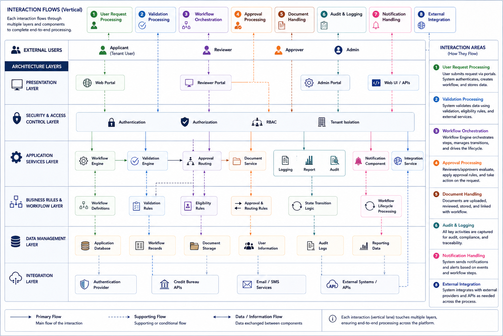

# Component Interaction Overview
This section illustrates how the major functional components of the **CardFlow Credit Origination Platform** collaborate to process user requests, enforce business rules, manage workflow progression, maintain audit records, and integrate with supporting services and external systems.

*Component Interaction Overview*
Interaction Area | Description
--- | ---
**User Request** | Processing	Users interact with the platform through web-based interfaces to initiate and manage workflow requests.
**Validation Processing** | Submitted requests are validated against workflow rules, eligibility conditions, and document requirements.
**Workflow Orchestration** | The workflow engine controls lifecycle progression, routing, and state transitions.
**Approval Processing** | Requests are routed to reviewers and approvers according to configurable approval rules.
**Document Handling** | Supporting documents are uploaded, stored, and linked to workflow requests.
**Audit and Logging** | Workflow actions and status changes are recorded for traceability and compliance purposes.
**Notification Handling** | Notifications are generated based on workflow events and approval outcomes.
**External Integration** | External services support authentication, notifications, and third-party integrations.

*Component Interaction Overview*