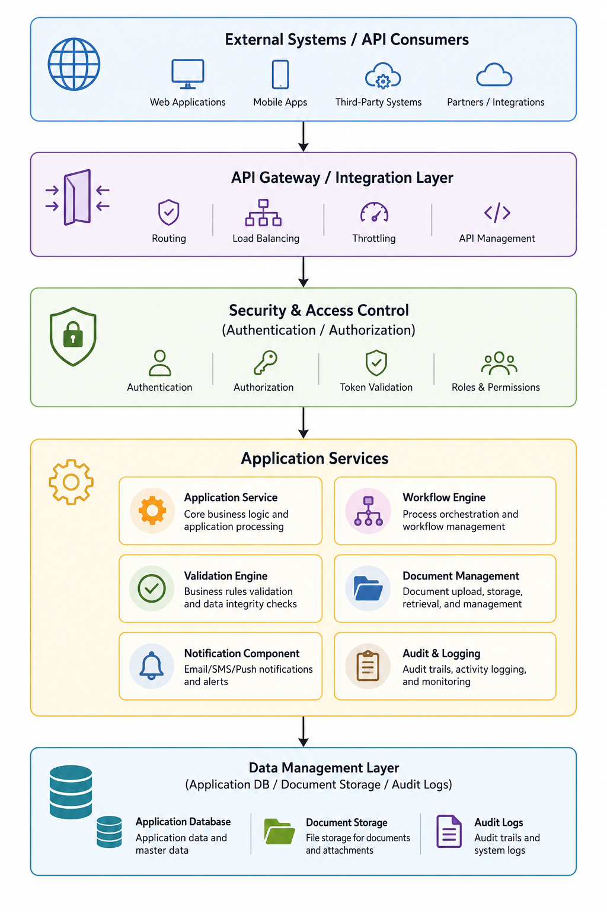

# API Architecture
This subsection describes how API-based interactions are structured within the **CardFlow Credit Origination Platform**. APIs allow internal and external systems to exchange data securely with the platform while supporting workflow-related operations such as application creation, data retrieval, status updates, and external validation.

The API architecture supports:
- Secure API access through authentication and authorization.
- Request validation before processing.
- Controlled access to application and workflow data.
- Integration with workflow, validation, document, audit, and notification services.
- Consistent response handling for successful and failed API requests.

When an external system sends a request to create a credit application:

1. The request enters through the API Gateway / Integration Layer.
2. The Security & Access Control layer checks authentication and permissions.
3. The request is passed to the Application Service.
4. The Validation Engine checks required data.
5. The Workflow Engine creates the workflow record.
6. The Data Management Layer stores the application.
7. The Audit & Logging component records the event.

*API Architecture*

*API Architecture*
Diagram Area | Descriptions
--- | ---
**External Systems / API Consumers** | Third-party systems or partner applications that need to exchange data with CardFlow.
**Integration Layer/ API Gateway** | Entry point for API requests. It receives requests, routes them, and standardizes communication.
**Security & Access Control** | Verifies whether the request is authenticated and authorized before allowing access.
**Application Services** | Handles the actual business operation, such as creating an application, validating data, updating workflow status, sending notifications, or writing audit logs.
**Data Management Layer** | Stores or retrieves application records, documents, workflow data, and audit logs.