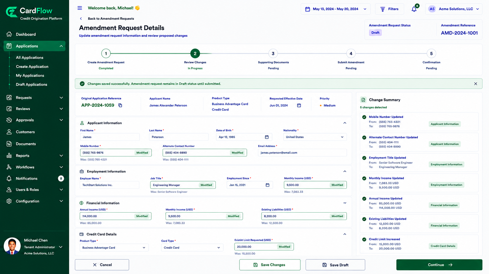

# Updating Information

Update the information that requires modification as part of the amendment request.

To update information:
1.	Open the amendment request.
2.	Navigate to the section requiring modification.
3.	Update the necessary fields.

  	Examples of information that may be updated include:
    - Applicant details
    - Contact information
    - Employment information
    - Financial information
    - Credit card details
    - Other application-specific information
4.	Review the modified information for accuracy.

*Updating Information*

5.	Save your changes.

**Result**: The updated information is stored in the amendment request and remains editable until submission.
