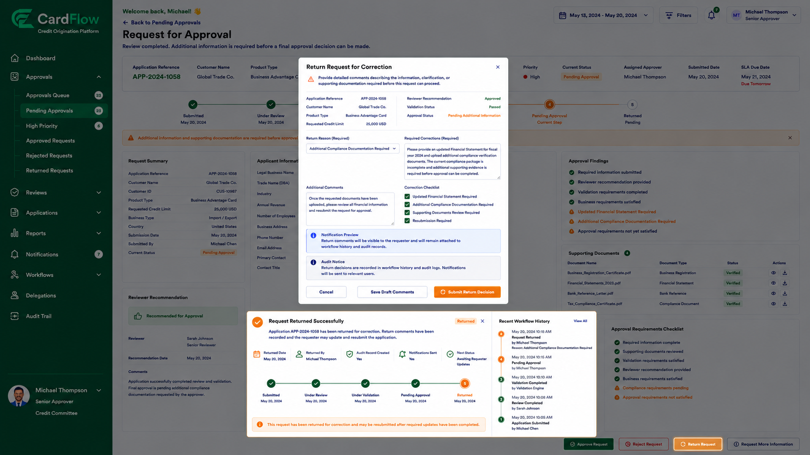

# Returning Requests
Approvers can return requests when additional information, clarification, or corrections are required before a final decision can be made.

To return a request:

1.	Open the request.
2.	Review the submitted information and supporting documents.
3.	Click **Return Request**.
4.	Enter the reason for the return.
5.	Specify the required corrections or additional information.
6.	Click **Submit Return Decision**.

When a request is returned:
- The request status changes to Returned.
- Return comments become available to the requester.
- The requester can update and resubmit the request.
- Workflow history is updated.
- Audit records are generated.

**Result**: The request is returned for correction and may be resubmitted after updates are completed.

*Returning Requests*