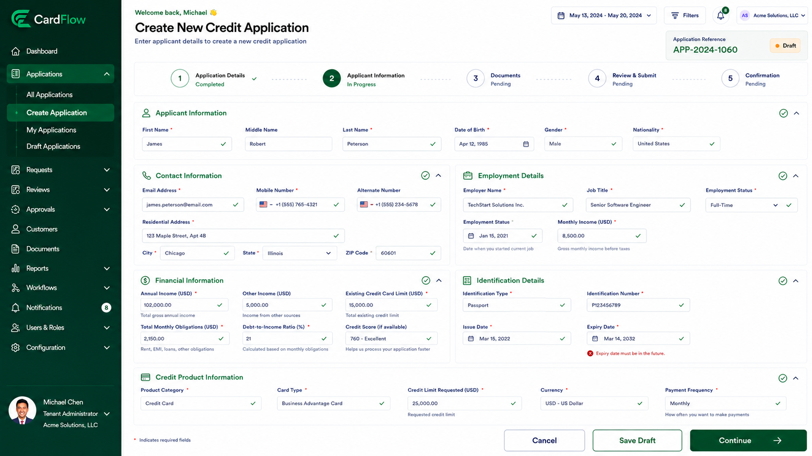

# Completing Applicant Information
Applicant information must be provided before an application can be submitted for review.
> **Note**: Required fields ( * ) are validated by the system during data entry and submission.

|Section|Information|
|---|---|
Application Details|	Application Type * Application Date
|Applicant Information|	Title  First Name *  Middle Name  Last Name *  Date of Birth *|
|Contact Information|	Email Address*  Mobile Number *  Alternate Number  Residential Address *  City *  State *  ZIP Code *  Country *|
|Employment Details| Employment Type *  Employer Name *  Designation *  Employment Since *  Monthly Income * Annual Income * Other Income|
|Financial Information|	Total Monthly Obligations *  Existing Credit Card Limit  Credit Score (if available) Debt-to-Income Ratio|
|Credit Product Details| Product Category *  Card Type *  Credit Limit Requested *  Currency *  Payment Frequency *|

*Completing Applicant Information – Inline Validations*