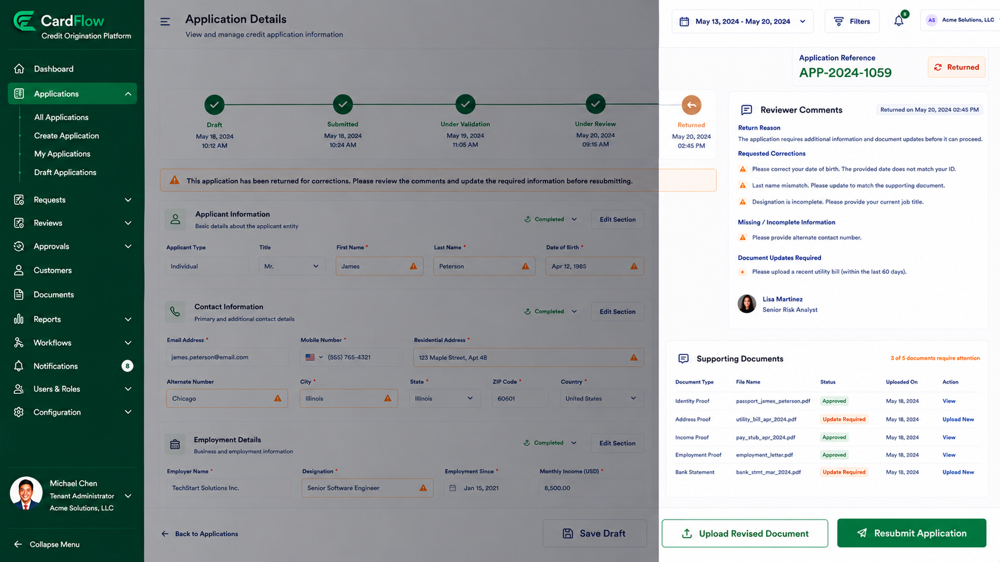

# Correcting Returned Applications
Applications may be returned when additional information, clarification, or document updates are required.

To update a returned application:
1.	Open the returned application.
2.	Review reviewer comments and return reasons.
3.	Update the required information.
4.	Upload revised or additional documents, if necessary.
5.	Click Resubmit Application.

**Result**: The application re-enters the workflow for continued processing and review.

*Correcting Returned Applications – Returned Application Details screen*