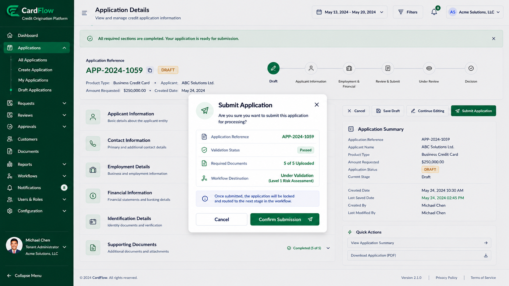

# Submitting an Application
Once all required information and supporting documents have been provided, the application can be submitted for processing.

To submit an application:
1.	Review the application details.
2.	Verify that all mandatory information has been completed.
3.	Confirm that required documents have been uploaded.
4.	Click **Submit Application**.
5.	Confirm the submission.

**Result**: After submission, the application enters the workflow lifecycle and becomes available for validation and review activities.

*Submitting an Application – Confirm Submission*

*Submitting an Application – Application Details*
