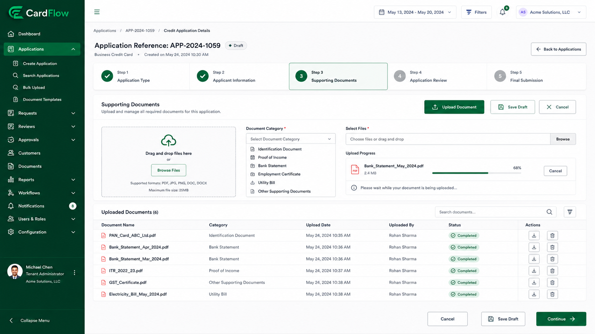
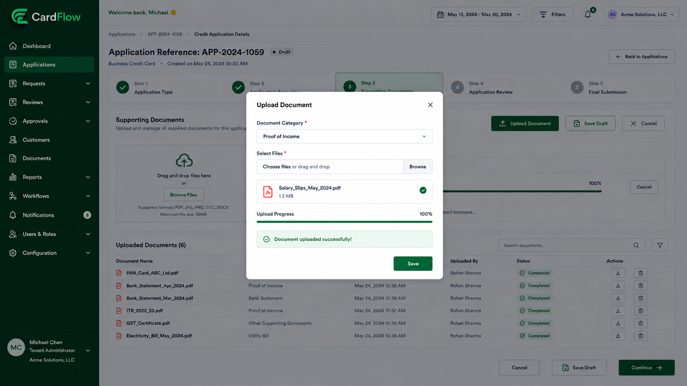

# Uploading Supporting Documents
Supporting documents may be required to validate applicant information and satisfy business or regulatory requirements.

To upload documents:
1.	Open the application record.
2.	Navigate to the **Documents** section.
3.	Click **Upload Document**.
4.	Select the appropriate document category.
5.	Choose the file to upload.
6.	Confirm the upload.

**Result**: Uploaded documents become associated with the application record and are available to reviewers and approvers.

*Uploading Supporting Documents*

*Uploading Supporting Documents – Upload Document Modal Window*