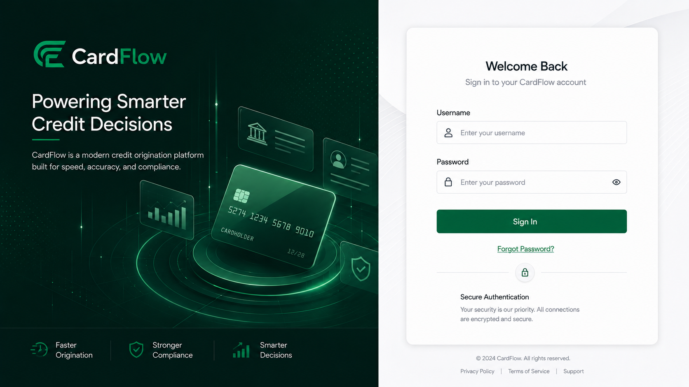

# System Access
Access to the platform is provided through a supported web browser and a valid user
account. Depending on assigned permissions, users may access applicant, tenant user,
reviewer, or approver functions in the platform.

Before accessing the system, users should ensure that:
- A valid user account has been created.
-  Login credentials have been provided.
- A supported web browser is available.
- Network connectivity to the platform is established.

*Login Page*

# Logging In

Users must authenticate using their assigned credentials before accessing platform features.

To log in:
1. Open the **CardFlow Credit Origination Platform** URL.
2. Enter your username or email address.
3. Enter your password.
4. Click **Sign In**.

**Result**: Upon successful authentication, the system displays the appropriate dashboard
based on your assigned role.

*Tenant Dashboard*