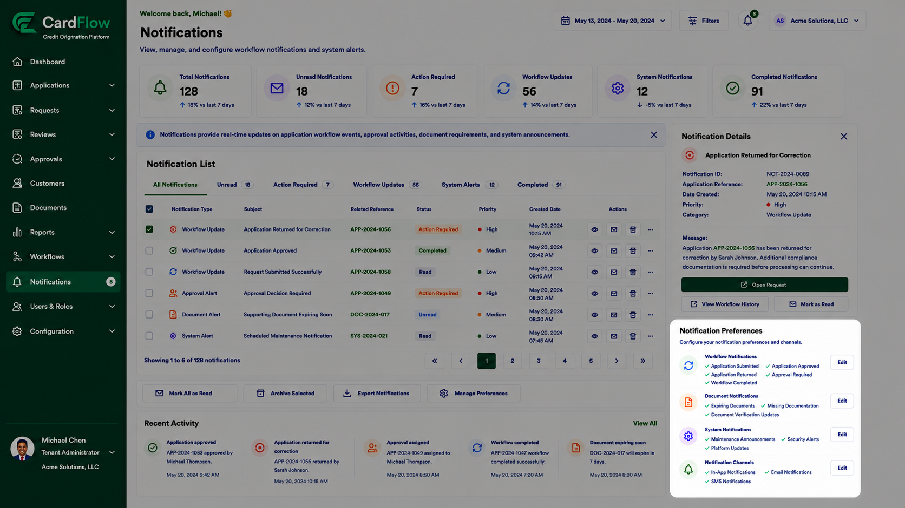

# Managing Notification Preferences
Users can configure how **CardFlow Credit Origination Platform** delivers notifications.

To manage notification preferences:
1.	Navigate to **Notifications**.
2.	Locate the **Notification Preferences** panel.
3.	Select the notification categories to receive.
4.	Configure preferred notification channels.
5.	Save the updated preferences.

Available notification settings may include:
 
- Workflow Notifications
- Application Submitted
- Application Approved
- Application Returned
- Approval Required
- Workflow Completed
- Document Notifications
- Expiring Documents
- Missing Documentation
- Document Verification Updates
- System Notifications
- Maintenance Announcements
- Security Alerts
- Platform Updates
- Notification Channels
- In-App Notifications
- Email Notifications
- SMS Notification 
 
**Result**: Notification delivery preferences are updated.

*Managing Notification Preferences*
