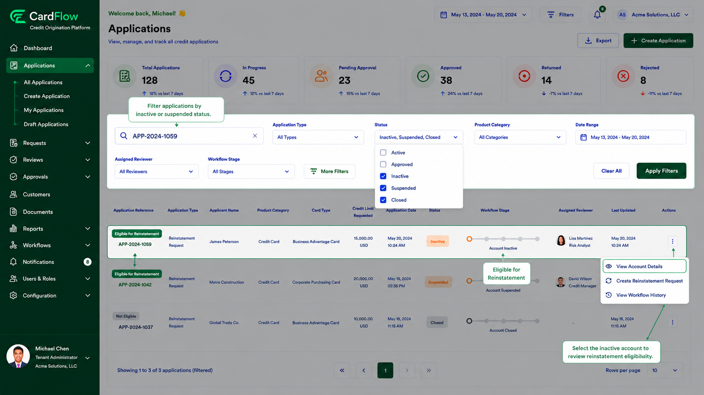

# Finding an Inactive Account
Locate the inactive or suspended account that requires reinstatement before creating a reinstatement request.
To find an inactive account:
1.	Open the **Applications** page.
2.	Use the search field to locate the account by:
    - **Application Reference Number**
    - **Applicant Name**
    - **Customer ID**
3.	Apply filters as needed.
4.	Select **Inactive**, **Suspended**, or **Closed** status.
5.	Open the account record.

**Result**: The account details page is displayed, showing the current account status and reinstatement eligibility information.

*Finding an Inactive Account*