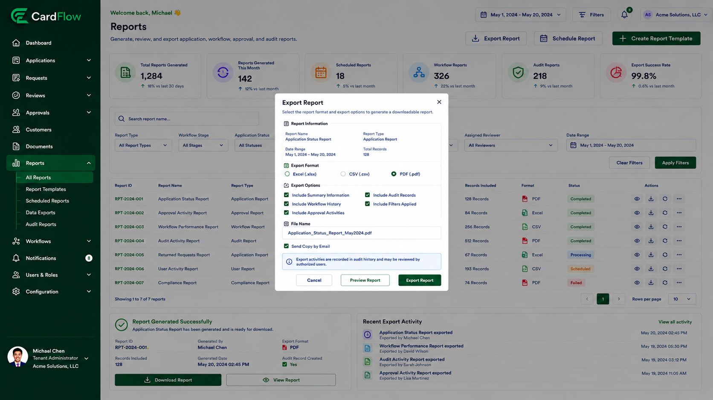

# Exporting Reports
Users can export application and workflow information for reporting, operational review, or audit purposes.

To export report data:
1.	Navigate to **Reports**.
2.	Apply search criteria or filters as required.
3.	Click **Export**.
4.	Select the preferred export format.
5.	Download the generated report.

Depending on user permissions, available export formats may include:
- Excel (.xlsx)
- CSV (.csv)
- PDF (.pdf)

Common report types include:
- Application Status Reports
- Approval Activity Reports
- Workflow Performance Reports
- Returned Requests Reports
- Audit Activity Reports

**Result**: The selected report is generated and downloaded in the chosen format.

*Exporting Reports*