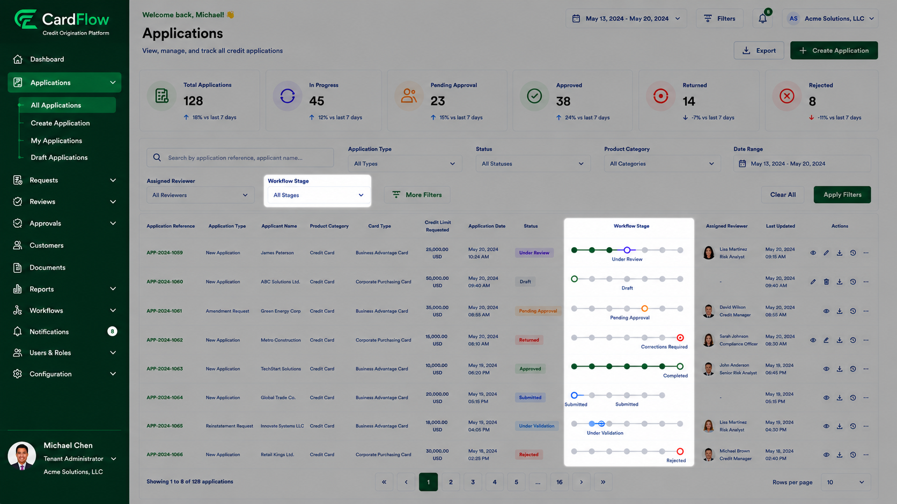
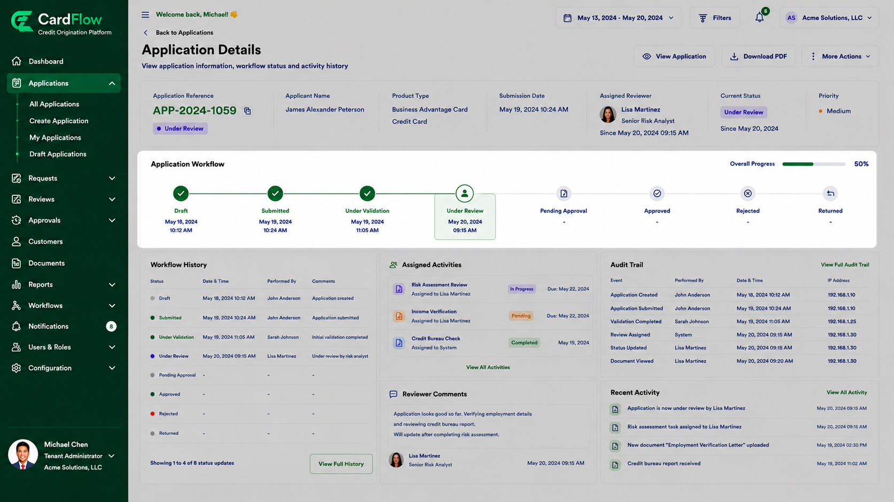

# Viewing Request Status
Users can view the status of submitted applications and requests throughout the workflow lifecycle.

To view request status:
1.	Navigate to **Applications**.
2.	Locate the required application.
3.	Review the **Workflow Stage** section.
4.	Open the application to view detailed workflow information.

The system may display statuses such as:

*Request Status*
Status | Description
--- | ---
**Draft** | Application has not been submitted.
**Submitted** | Application has been submitted for processing.
**Under Review** | Request is being reviewed.
**Under Validation** | Validation checks are in progress.
**Pending Approval** | Awaiting approver decision.
**Approved** | Request has been approved.
**Returned** | Request requires updates or corrections.
**Rejected** | Request has been rejected.

**Result**: The user can determine the current processing stage and overall progress of the request.

*Viewing Request Status – Workflow Stage*

*Viewing Request Status – Application Workflow*