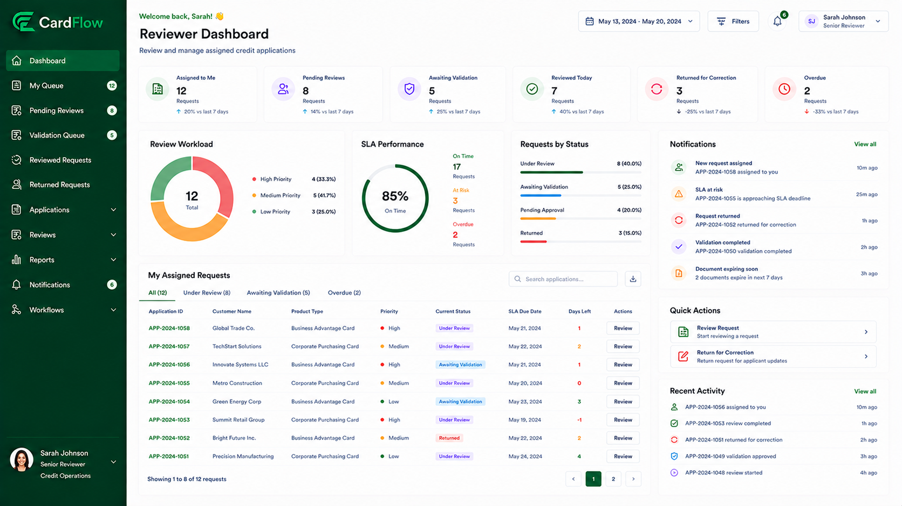

# Monitoring Review Activities
Reviewers can monitor requests currently assigned to them.

To monitor review activities:
1.	Navigate to Dashboard.

*Reviewer Dashboard*

2.	Review request counts by status.
3.	Review pending review assignments.
4.	Monitor returned and resubmitted requests.

**Result**: The reviewer can track workload and request progress.
