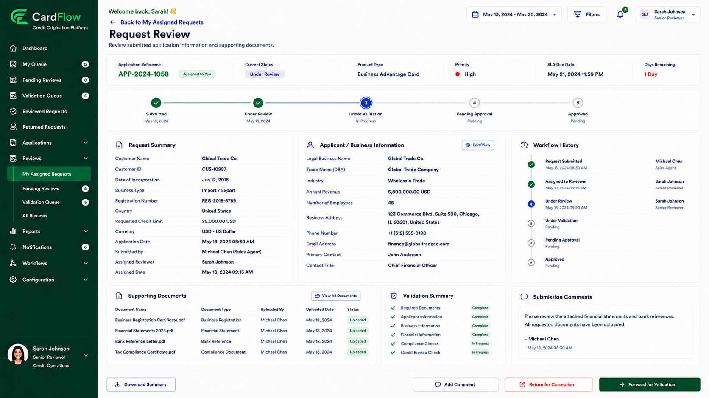

# Reviewing Request Details
Reviewers can review submitted information before making a routing decision.
To review request details:
1.	Open the assigned request.
2.	Review the request summary information.
3.	Verify submitted applicant or account information.
4.	Review workflow status and request history.
5.	Review any comments provided during submission.

**Result**: The reviewer can determine whether the request contains sufficient information for processing.

*Reviewing Request Details – Request Review Screen*