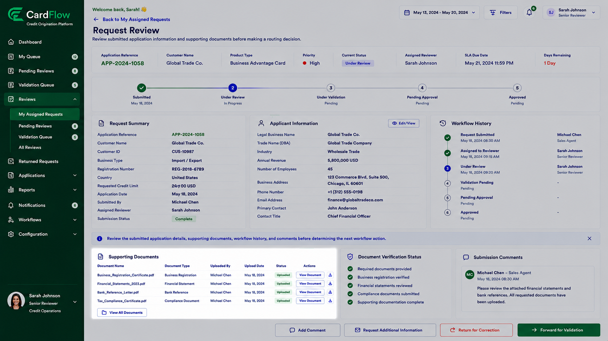

# Reviewing Supporting Documents
Reviewers can review uploaded supporting documents associated with a request.
To review supporting documents:
1.	Open the request.
2.	Navigate to the **Supporting Documents** section.
3.	Select a document from the document list.
4.	Review the document contents.
5.	Verify that all required supporting documentation has been provided.

**Result**: The reviewer confirms whether the submitted documentation supports the request.

*Reviewing Supporting Documents*