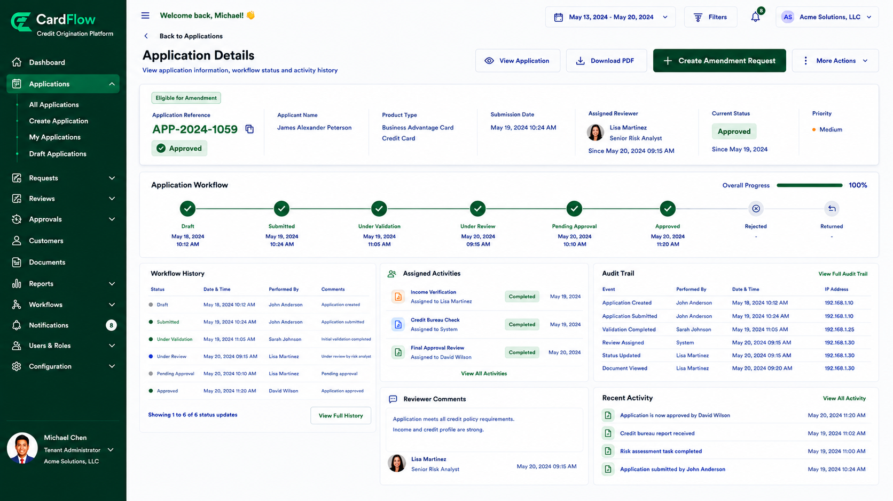
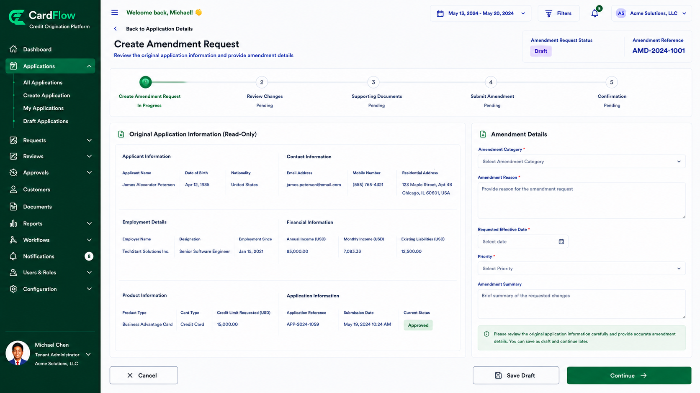
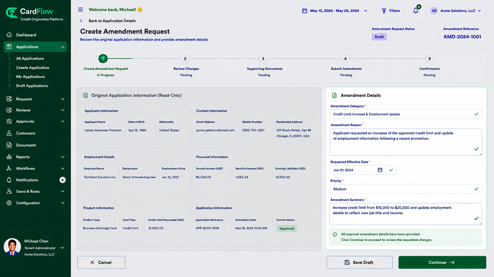

# Creating an Amendment Request

Create an amendment request to initiate modifications to an existing application or account.
To create an amendment request:
1.	Open the application or account record.

 
*Creating an Amendment Request – Create an Amendment Request Button*

2.	Click **Create Amendment Request**.

    **Create Amendment Request** screen displays.

*Creating an Amendment Request – Create Amendment Request Screen*

3.	Review the current application information.
4.	Provide a reason for the amendment.

*Creating an Amendment Request – Reasons for Amendment*

5.	Confirm that the request details are correct.
6.	Click **Continue**.

    The system verifies whether the selected record is eligible for amendment processing.

**Result:** A new amendment request is created and saved in **Draft** status.
 
test-reference [1]

[1]: https://en.wikipedia.org/wiki/Hobbit#Lifestyle