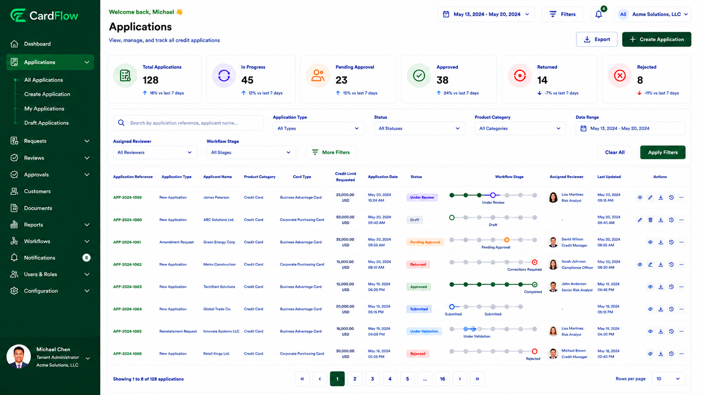
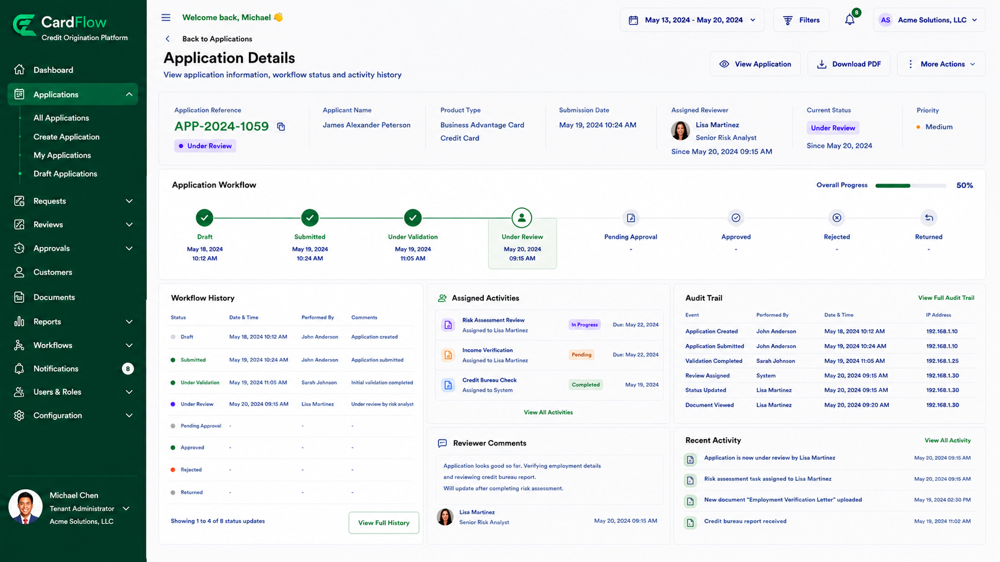
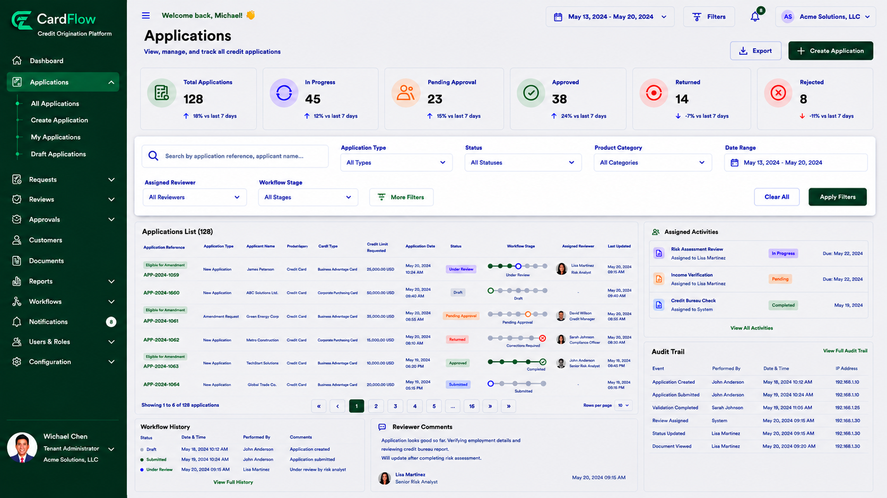

# Locating an Existing Record
Before creating an amendment request, locate the credit application or account that requires modification.

To locate an existing record:
1.	Navigate to **Applications > All Applications**

*Processing Application Screen*

2.	Use the search field to locate the application by:
    - **Application Reference Number**
    - **Applicant Name**
    - **Account Number**
    - Other available search criteria

3. Review the search results.
4. Select the appropriate record to open the **Application Details** screen.

*Submitting an Application – Application Details*

5. Verify that the record is eligible for amendment before proceeding.

**Result**: The selected application or account record is displayed and ready for amendment processing.

*Locating an Existing Record – Search Filters*
