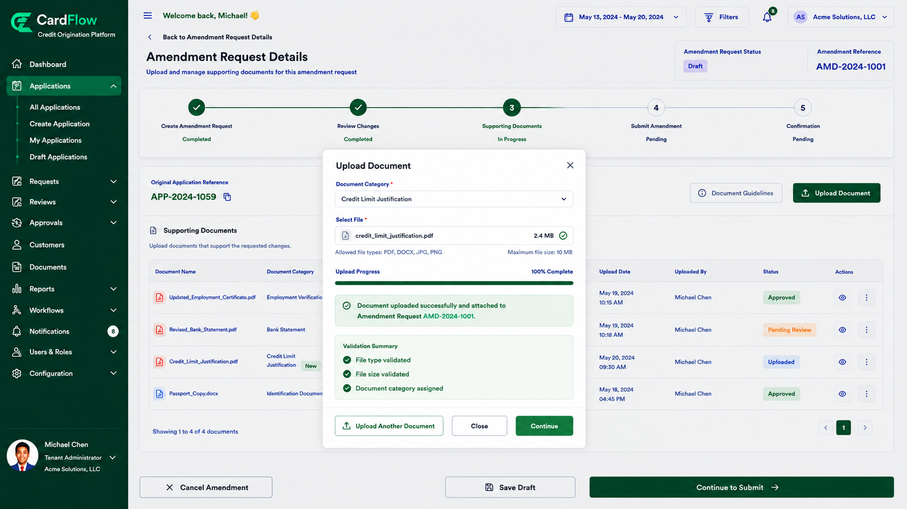

# Uploading Amendment Documents
Supporting documents may be required to justify the requested changes.
To upload amendment documents:
1.	Open the amendment request.
2.	Navigate to the **Supporting Documents** section.
3.	Click **Upload Document**.
4.	Select the appropriate document category.
5.	Browse and select the file to upload.
6.	Click **Upload**.
7.	Repeat the process for additional supporting documents if required.

    The system validates uploaded documents based on configured file type and file size requirements.

**Result**: The uploaded documents are attached to the amendment request and become available for review.

*Uploading Amendment Documents*