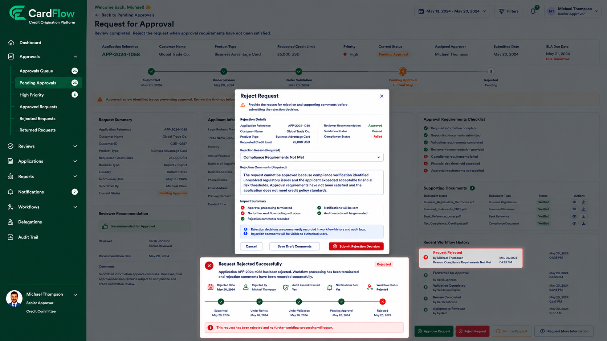

# Rejecting Requests
Approvers can reject requests that do not satisfy approval requirements.

To reject a request:
1.	Open the request.
2.	Review the submitted information and supporting documents.
3.	Click **Reject Request**.
4.	Enter the reason for rejection.
5.	Provide supporting comments.
6.	Click **Submit Rejection Decision**.

When a request is rejected:
- The request status changes to Rejected.
- No further workflow processing occurs.
- Rejection comments are recorded in workflow history.
- Notifications are sent to relevant users.
- Audit records are generated.

**Result**: The request is rejected and the workflow is terminated.

*Rejecting Request*