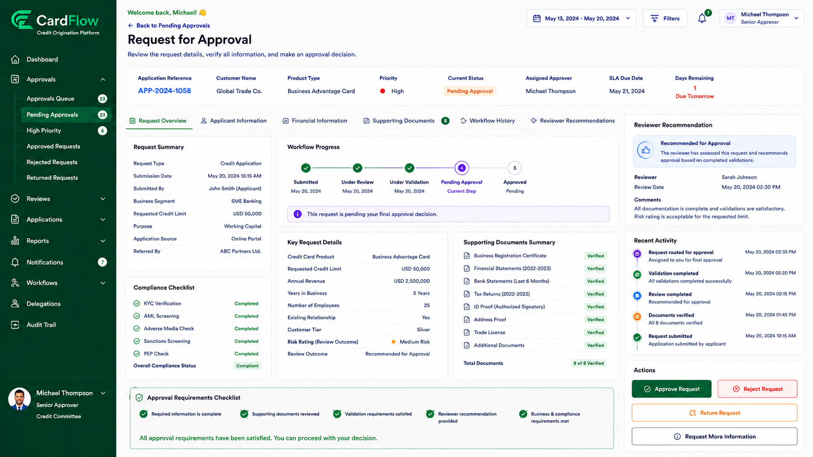

# Reviewing Request Information
Approvers can review submitted information before making an approval decision.
To review request information:
1.	Open a request from the Pending Approvals queue.
2.	Review the request summary information.
3.	Verify submitted applicant or account information.
4.	Review workflow history and reviewer recommendations.
5.	Review supporting documents and comments.
6.	Confirm that all approval requirements have been satisfied.

Approvers should verify that:
- Required information is complete.
- Supporting documents have been reviewed.
- Validation requirements have been satisfied.
- Reviewer recommendations have been provided.
- Business and compliance requirements have been met.

**Result**: The approver determines whether the request is eligible for approval.

*Reviewing Request Information*