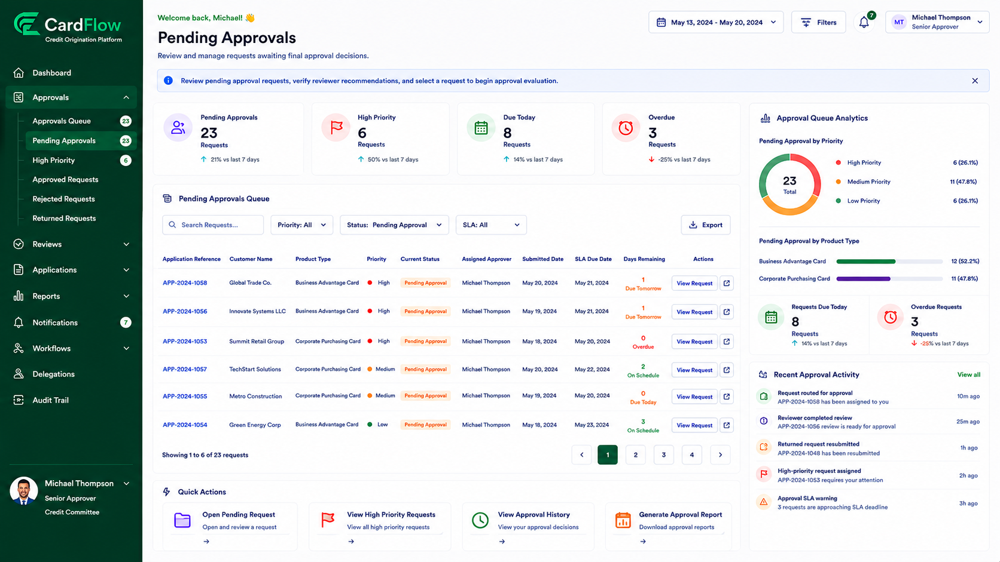

# Viewing Pending Approvals
Approvers can access requests that have been routed to them for approval.
To view pending approvals:
1.	Navigate to **Approvals**.
2.	Select **Pending Approvals**.

    The **Pending Approvals** page displays key request information including customer name, product type, priority, status, assigned approver, submission date, and SLA due date.
3.	Review the list of requests awaiting approval.
4.	Use available filters to locate a specific request.
5.	Click the request reference number to open the request details page.

**Result**: The selected request is displayed for approval review.

*Viewing Pending Approvals*