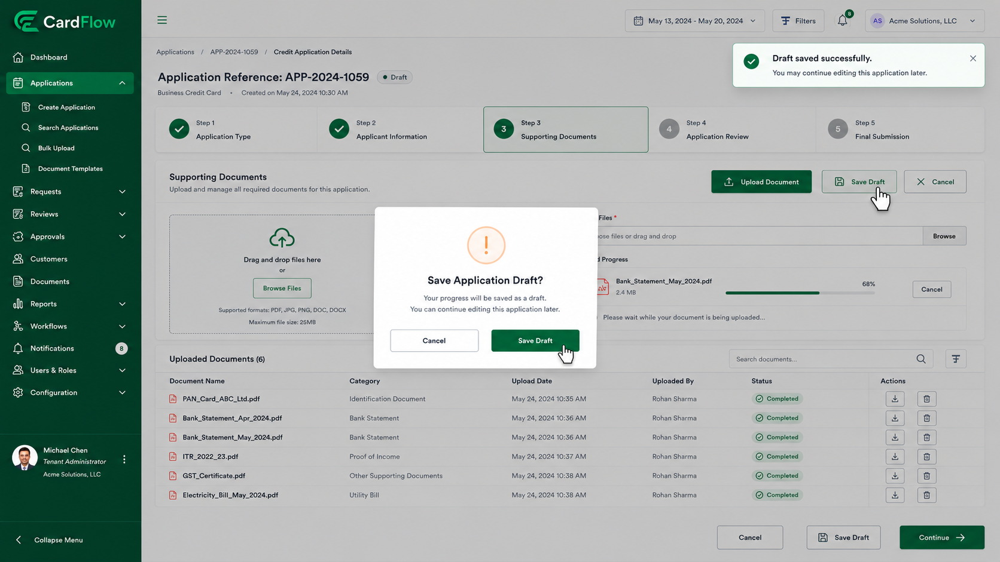
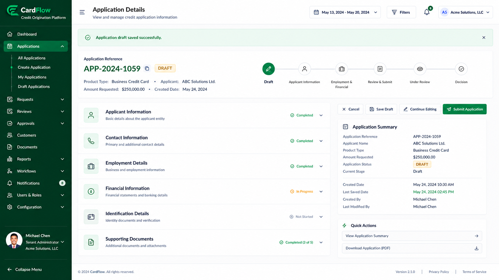

# Saving Draft Applications
Applications may be saved as drafts when additional information or documentation is required before submission.

To save an application as a draft:
1. Complete the available application details.
2. Click **Save Draft**.

*Saving Draft Application – Confirmation Message*

3. Continue working on the application later.

**Result**: Draft applications remain editable until submitted for workflow processing.

*Saving Draft Application – Application Details (Draft)*