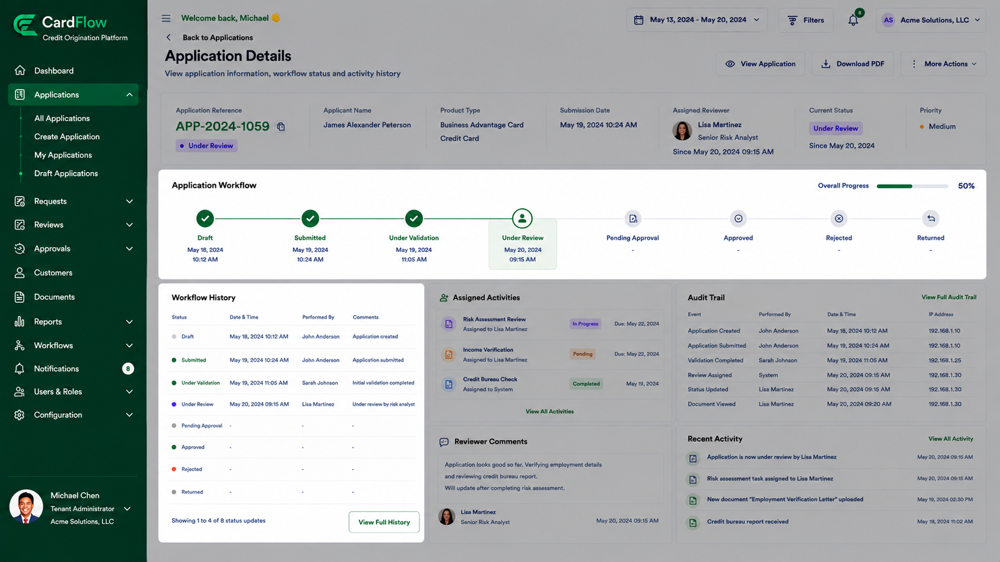
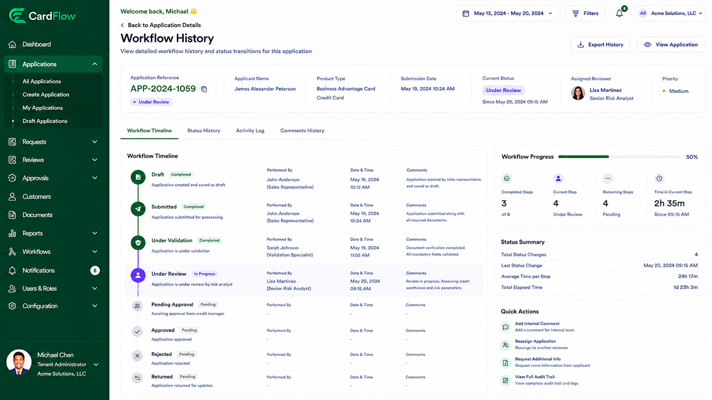

# Tracking Application Status
Users can monitor application progress throughout the credit origination lifecycle.

Application statuses may include:
- **Draft**
- **Submitted**
- **Under Validation**
- **Under Review**
- **Pending Approval**
- **Approved**
- **Rejected**
- **Returned**

> **Note:** Status Information is available from the dashboard, application details page, and workflow history views.

*Tracking Application Status – Application Workflow and Workflow History*

*Tracking Application Status – Workflow History Screen*